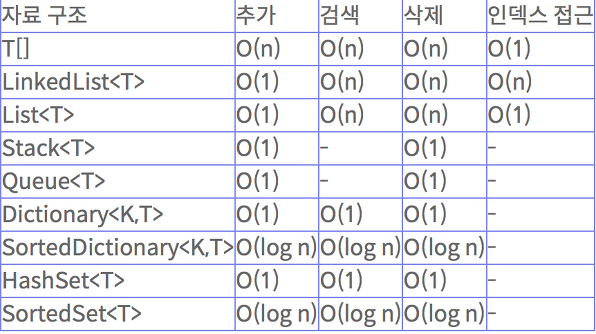

# Fast_Campus_Study
  Learning on a Fast_Campus

___
## __02.27__
> **<h3>Today Dev Story</h3>**
  - __배경의 이동__
    -  
    - Render의 OffsetX를 활용해서 배경의 전환 구현 
      <details>
      <summary>코드 보기</summary>

      ```c#
      
      [System.Serializable]   //직렬화
      public class BGScrollData
      {
        public Renderer RenderForScroll;    //Material임
        public float Speed;
        public float OffsetX;
      }

      public class BGScroller : MonoBehaviour
      {
        [SerializeField]
        BGScrollData[] ScrollDatas;

        private void FixedUpdate()
        {
          UpdateScroll();
        }

        void UpdateScroll()
        {
          for (int i = 0; i < ScrollDatas.Length; i++)
          {
            SetTextureOffset(ScrollDatas[i]);
          }
        }

        void SetTextureOffset(BGScrollData scrollData)
        {
          scrollData.OffsetX += (float)(scrollData.Speed) * TimefixedDeltaTime;
        
          if (scrollData.OffsetX > 1) //혹시 모를 오류 방지
          {
            scrollData.OffsetX = scrollData.OffsetX % 1.0f;
          }

          Vector2 Offset = new Vector2(scrollData.OffsetX, 0);
          scrollData.RenderForScroll.material.SetTextureOffset("_MainTex", Offset);   //_MainTex 는 프로퍼티 이름 
        }
      }
      
      ```

      </details>
  
  - __Player의 이동__
    -   
    - Vector3를 사용하여 Player 이동 구현
    - 해당 키가 눌리면 transform.postion을 조작
     
      <details>
      <summary>코드 보기</summary>

      ```c#
      //SystemManager.cs 에서 Player 접근가능 (싱글톤)
      [SerializeField]
      Player player;

      public Player Hero  //접근 프로퍼티
      {
        get { return player; }
      }

      //inputController.cs 에서 SystemManager을 통해 Player에 접근
      void UpateInput()
      {
        Vector3 moveDirection = Vector3.zero;
        if(Input.GetKey(KeyCode.W) || Input.GetKey(KeyCode.UpArrow))
        {
            moveDirection.y = 1;
        }
        ...
        ...
        ...
        SystemManager.Instance.Hero.ProcessInput(moveDirection);  //함수 실행
      }
      ```
      </details> 

    - 이동제한 구현
    - 배경의 localScale과 플레이어의 Postion,Colider를 이용하여 판단
      <details>
      <summary>코드 보기</summary>

      ```c#
      Vector3 AdjustMoveVector(Vector3 moveVector)  
      {
        Vector3 result = Vector3.zero;
        result = boxCollider.transform.position + moveVector;   //곧 Player의 위치

        if(result.x - boxCollider.size.x * 0.5f < -MainBGQuadTransform.localScale.x * 0.5f)
        {
            moveVector.x = 0;
        }
        if (result.x + boxCollider.size.x * 0.5f > MainBGQuadTransform.localScale.x * 0.5f)
        {
            moveVector.x = 0;
        }
        if (result.y - boxCollider.size.y * 0.5f < -MainBGQuadTransform.localScale.y * 0.5f)
        {
            moveVector.y = 0;
        }
        if (result.y + boxCollider.size.y * 0.5f > MainBGQuadTransform.localScale.y * 0.5f)
        {
            moveVector.y = 0;
        }

        return moveVector;
      }
      ```
      </details> 
  
  - __Enemy 클래스 제작__
    -  
    - 상태에 따른 행동 구현 
    - 행동별로 메서드를 구분하여 접근하기 쉽게 제작
      <details>
      <summary>코드 보기</summary>

      ```c#
      public enum State : int //int 상속
      {
        None = -1,  //사용전
        Ready = 0,  //준비완료
        Appear,     //등장
        Battle,     //전투중
        Dead,       //사망
        Disapper,   //퇴장
      }

      [SerializeField]
      State CurrentState = State.None;    //현재 상태

      const float MaxSpeed = 10.0f;       //변하지 않는 속도 값(가속을 이용할껀디)
      const float MaxSpeedTime = 0.5f;    //가속 시간

      [SerializeField]
      Vector3 TargetPostion;  //현재 목표로인 위치

      [SerializeField]
      float CurrentSpeed;     //현재 속도

      Vector3 CurrentVelocity;
      float MoveStartTime = 0.0f; //움직이기 시작한 시간 --> 속도를 점점 증가 시키기 위함

      //시간의 흐름을 측정하기 위함
      float BattleStartTime = 0.0f;   //

      void FixedUpdate()
      {
        if(Input.GetKeyDown(KeyCode.L)) //적의 등장
        {
          Appear(new Vector3(7,transform.position.y,transform.position.z));
        }

        switch(CurrentState)    //현재 상태에 따른 행동들
        {
          case State.None:
          case State.Ready:
            break;

          case State.Dead:
            break;

          case State.Appear:
          case State.Disapper:
            UpdateSpeed();
            UpdateMove();
            break;

          case State.Battle:
            UpdateBattle();
            break;

          default:
            break;
        }
      }

      void UpdateSpeed()  //속도의 갱신
      {
        CurrentSpeed = Mathf.Lerp(CurrentSpeed,MaxSpeed, (Time.time - MoveStartTime)/MaxSpeedTime);    //두 값 사이의 어딘가를 반환
      }

      void UpdateMove()   //이동
      {
        float distance = Vector3.Distance(TargetPostion, transform.position);   //타겟까지의 거리
        if (distance == 0)  //도착 판단
        {
          Arrived();
          return;
        }
        CurrentVelocity = (TargetPostion - transform.position).normalized * CurrentSpeed; //초당 방향 벡터(크키 1)

        //실질적으로 이동하는 부분 --> 속도 = 거리/시간
        transform.position = Vector3.SmoothDamp(transform.position, TargetPostion, ref CurrentVelocity, distance/CurrentSpeed, MaxSpeed);   //자연스럽게 이동
      }
      void Arrived()      //도착 알림
      {
        CurrentSpeed = 0;
        if (CurrentState == State.Appear)
        {
          CurrentState = State.Battle;
          BattleStartTime = Time.time;    //배틀 시작 시간
        }
        else //if (CurrentState == State.Disapper)
        {
          CurrentState = State.None;
        }
      }
      public void Appear(Vector3 targetPos)   //등장
      {
        TargetPostion = targetPos;
        CurrentSpeed = MaxSpeed;

        CurrentState = State.Appear;
        MoveStartTime = Time.time;
      }
      void Disapper(Vector3 targetPos)    //소멸
      {
        TargetPostion = targetPos;
        CurrentSpeed = 0;

        CurrentState = State.Disapper;
        MoveStartTime = Time.time;
      }
      void UpdateBattle() 
      {
        if(Time.time - BattleStartTime > 3f)
        {
          Disapper(new Vector3(-15,transform.position.y,transform.position.z));
        }
      }
      ```
      </details> 

> **<h3>Realization</h3>**
  - Vector3.sqrMagnitude 
    - 해당 벡터의 값이 모두 0인지 확인
  - 매개변수에 ref,out 키워드
    - 복사된 값을 넘겨주는 것이므로 실제 값에는 영향이 없다.
    - call by refernce (참조객체)
      - ref : 이미 초기화가 끝난 상태여야 함, 외부에서 내부로 값을 전달시 사용
      - out : 초기화 안해도 상괍 없음   
___
## __03.03__
> **<h3>Today Dev Story</h3>**
  - ### __플레이어와 적기 사이의 충돌 감지__
    - OnTriggerEnter(Collider other)를 사용해서 부딪치는 오브젝트를 감지
      <details>
      <summary>코드 보기</summary>

      ```c#
      private void OnTriggerEnter(Collider other) //상대방의 정보가 나온다.
      {
        Player player = other.GetComponentInParent<Player>(); //부딪친거는 박스 콜라이더니까 상위인 부모 호출
        if (player)
        {
            player.OnCrash(this);   
        }
      }

      public void OnCrash(Player player)    //내가 부딪친거
      {
        Debug.Log("OnCrash player = " + player);
      }
      ```
      </details>   
  - ### __EnemyFactory 생성__
    - Prefabs과 Instantiate 사용 
    - Enemy Prefab을 Dictionary의 키로 사용하여 캐싱
    - 굳이 이렇게 하는 이유를 모르겠다.
      <details>
      <summary>코드 보기</summary>

      ```c#
      public const string EnemyFath = "Prefabs/Enemy";

      //프리팹을 키로 사용하여 캐싱
      Dictionary<string, GameObject> EnemyFileCache = new Dictionary<string, GameObject>();

      public GameObject Load(string resourcePath)
      {
        GameObject go = null;

        if (EnemyFileCache.ContainsKey(resourcePath))        //이미 로드되어있는 경우
        {
          go = EnemyFileCache[resourcePath];    //메모리 상에 올라와 있는 것을 가져온다.
        }
        else     
        {
          go = Resources.Load<GameObject>(resourcePath);  //프리팹을 메모리에 로드한다.
          if (!go)
          {
            Debug.LogError("Load Error! path = " + resourcePath);
            return null;
          }

          EnemyFileCache.Add(resourcePath, go);
        }

        GameObject instancedGo = Instantiate<GameObject>(go);

        return instancedGo;
      }
      ```
      </details>
  - ### __EnemyManager 생성__
    - EnemyFactory과 연동하여 Enemy의 생성에 직접적으로 관여한다. 
    - List를 사용하여 모든 Enemy들을 관리
      <details>
      <summary>코드 보기</summary>

      ```c#
      [SerializeField]
      EnemyFactory enemyFactory;

      List<Enemy> enemies = new List<Enemy>();

      private void Update()
      {
        if (Input.GetKeyDown(KeyCode.L)) //적의 등장
        {
            GenerateEnemy(new Vector3(15, 0, 0));
        }
      }

      public bool GenerateEnemy(Vector3 position)
      {
        GameObject go = enemyFactory.Load(EnemyFactory.EnemyFath);  //프리펩 호출
        if(go == null)
        {
          Debug.LogError("GenerateEnemy Error!");
          return false;
        }
        go.transform.position = position;

        Enemy enemy = go.GetComponent<Enemy>(); 
        enemy.Appear(new Vector3(7, 0, 0));

        enemies.Add(enemy);
        return true;
      }
      ```
      </details>
> **<h3>Realization</h3>**
  - ### __OnTriggerEnter()메서드 사용__
    - istrigger 체크 되어있는 것만 해당 
  - ### __자료구조__
  - 
     
    - Dictionary
      - 큐, 스택같은 개념  
      - 사용자가 원하는데로 키를 설정할 수 있다.  int형뿐만 아니라 문자열이나 다양한 변수형도 가능하다.
    - List
      - 비슷하게 활용된다.   