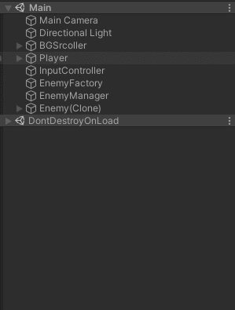

# Fast_Campus_Study
  Learning on a Fast_Campus

___
## 깨달은점
  - 메서드가 굉장히 많다.
  - 하나만 싱글톤화 하고 거기에 끌어와서 사용한다.
  - 이름이 굉장히 길다.
  - 상속받는 개념 사용 시 Update는 한번만 사용한다.
___
## __02.27__
> **<h3>Today Dev Story</h3>**
  - __배경의 이동__
   
       

    - Render의 OffsetX를 활용해서 배경의 전환 구현 
      <details>
      <summary>코드 보기</summary>

      ```c#
      
      [System.Serializable]   //직렬화
      public class BGScrollData
      {
        public Renderer RenderForScroll;    //Material임
        public float Speed;
        public float OffsetX;
      }

      public class BGScroller : MonoBehaviour
      {
        [SerializeField]
        BGScrollData[] ScrollDatas;

        private void FixedUpdate()
        {
          UpdateScroll();
        }

        void UpdateScroll()
        {
          for (int i = 0; i < ScrollDatas.Length; i++)
          {
            SetTextureOffset(ScrollDatas[i]);
          }
        }

        void SetTextureOffset(BGScrollData scrollData)
        {
          scrollData.OffsetX += (float)(scrollData.Speed) * TimefixedDeltaTime;
        
          if (scrollData.OffsetX > 1) //혹시 모를 오류 방지
          {
            scrollData.OffsetX = scrollData.OffsetX % 1.0f;
          }

          Vector2 Offset = new Vector2(scrollData.OffsetX, 0);
          scrollData.RenderForScroll.material.SetTextureOffset("_MainTex", Offset);   //_MainTex 는 프로퍼티 이름 
        }
      }
      
      ```

      </details>
  
  - __Player의 이동__
   
        

    - Vector3를 사용하여 Player 이동 구현
    - 해당 키가 눌리면 transform.postion을 조작
     
      <details>
      <summary>코드 보기</summary>

      ```c#
      //SystemManager.cs 에서 Player 접근가능 (싱글톤)
      [SerializeField]
      Player player;

      public Player Hero  //접근 프로퍼티
      {
        get { return player; }
      }

      //inputController.cs 에서 SystemManager을 통해 Player에 접근
      void UpateInput()
      {
        Vector3 moveDirection = Vector3.zero;
        if(Input.GetKey(KeyCode.W) || Input.GetKey(KeyCode.UpArrow))
        {
            moveDirection.y = 1;
        }
        ...
        ...
        ...
        SystemManager.Instance.Hero.ProcessInput(moveDirection);  //함수 실행
      }
      ```
      </details> 

    - 이동제한 구현
    - 배경의 localScale과 플레이어의 Postion,Colider를 이용하여 판단
      <details>
      <summary>코드 보기</summary>

      ```c#
      Vector3 AdjustMoveVector(Vector3 moveVector)  
      {
        Vector3 result = Vector3.zero;
        result = boxCollider.transform.position + moveVector;   //곧 Player의 위치

        if(result.x - boxCollider.size.x * 0.5f < -MainBGQuadTransform.localScale.x * 0.5f)
        {
            moveVector.x = 0;
        }
        if (result.x + boxCollider.size.x * 0.5f > MainBGQuadTransform.localScale.x * 0.5f)
        {
            moveVector.x = 0;
        }
        if (result.y - boxCollider.size.y * 0.5f < -MainBGQuadTransform.localScale.y * 0.5f)
        {
            moveVector.y = 0;
        }
        if (result.y + boxCollider.size.y * 0.5f > MainBGQuadTransform.localScale.y * 0.5f)
        {
            moveVector.y = 0;
        }

        return moveVector;
      }
      ```
      </details> 
  
  - __Enemy 클래스 제작__
   
       

    - 상태에 따른 행동 구현 
    - 행동별로 메서드를 구분하여 접근하기 쉽게 제작
      <details>
      <summary>코드 보기</summary>

      ```c#
      public enum State : int //int 상속
      {
        None = -1,  //사용전
        Ready = 0,  //준비완료
        Appear,     //등장
        Battle,     //전투중
        Dead,       //사망
        Disapper,   //퇴장
      }

      [SerializeField]
      State CurrentState = State.None;    //현재 상태

      const float MaxSpeed = 10.0f;       //변하지 않는 속도 값(가속을 이용할껀디)
      const float MaxSpeedTime = 0.5f;    //가속 시간

      [SerializeField]
      Vector3 TargetPostion;  //현재 목표로인 위치

      [SerializeField]
      float CurrentSpeed;     //현재 속도

      Vector3 CurrentVelocity;
      float MoveStartTime = 0.0f; //움직이기 시작한 시간 --> 속도를 점점 증가 시키기 위함

      //시간의 흐름을 측정하기 위함
      float BattleStartTime = 0.0f;   //

      void FixedUpdate()
      {
        if(Input.GetKeyDown(KeyCode.L)) //적의 등장
        {
          Appear(new Vector3(7,transform.position.y,transform.position.z));
        }

        switch(CurrentState)    //현재 상태에 따른 행동들
        {
          case State.None:
          case State.Ready:
            break;

          case State.Dead:
            break;

          case State.Appear:
          case State.Disapper:
            UpdateSpeed();
            UpdateMove();
            break;

          case State.Battle:
            UpdateBattle();
            break;

          default:
            break;
        }
      }

      void UpdateSpeed()  //속도의 갱신
      {
        CurrentSpeed = Mathf.Lerp(CurrentSpeed,MaxSpeed, (Time.time - MoveStartTime)/MaxSpeedTime);    //두 값 사이의 어딘가를 반환
      }

      void UpdateMove()   //이동
      {
        float distance = Vector3.Distance(TargetPostion, transform.position);   //타겟까지의 거리
        if (distance == 0)  //도착 판단
        {
          Arrived();
          return;
        }
        CurrentVelocity = (TargetPostion - transform.position).normalized * CurrentSpeed; //초당 방향 벡터(크키 1)

        //실질적으로 이동하는 부분 --> 속도 = 거리/시간
        transform.position = Vector3.SmoothDamp(transform.position, TargetPostion, ref CurrentVelocity, distance/CurrentSpeed, MaxSpeed);   //자연스럽게 이동
      }
      void Arrived()      //도착 알림
      {
        CurrentSpeed = 0;
        if (CurrentState == State.Appear)
        {
          CurrentState = State.Battle;
          BattleStartTime = Time.time;    //배틀 시작 시간
        }
        else //if (CurrentState == State.Disapper)
        {
          CurrentState = State.None;
        }
      }
      public void Appear(Vector3 targetPos)   //등장
      {
        TargetPostion = targetPos;
        CurrentSpeed = MaxSpeed;

        CurrentState = State.Appear;
        MoveStartTime = Time.time;
      }
      void Disapper(Vector3 targetPos)    //소멸
      {
        TargetPostion = targetPos;
        CurrentSpeed = 0;

        CurrentState = State.Disapper;
        MoveStartTime = Time.time;
      }
      void UpdateBattle() 
      {
        if(Time.time - BattleStartTime > 3f)
        {
          Disapper(new Vector3(-15,transform.position.y,transform.position.z));
        }
      }
      ```
      </details> 

> **<h3>Realization</h3>**
  - Vector3.sqrMagnitude 
    - 해당 벡터의 값이 모두 0인지 확인
  - 매개변수에 ref,out 키워드
    - 복사된 값을 넘겨주는 것이므로 실제 값에는 영향이 없다.
    - call by refernce (참조객체)
      - ref : 이미 초기화가 끝난 상태여야 함, 외부에서 내부로 값을 전달시 사용
      - out : 초기화 안해도 상괍 없음   
___
## __03.03__
> **<h3>Today Dev Story</h3>**
  - ### __플레이어와 적기 사이의 충돌 감지__
    - OnTriggerEnter(Collider other)를 사용해서 부딪치는 오브젝트를 감지
      <details>
      <summary>코드 보기</summary>

      ```c#
      private void OnTriggerEnter(Collider other) //상대방의 정보가 나온다.
      {
        Player player = other.GetComponentInParent<Player>(); //부딪친거는 박스 콜라이더니까 상위인 부모 호출
        if (player)
        {
            player.OnCrash(this);   
        }
      }

      public void OnCrash(Player player)    //내가 부딪친거
      {
        Debug.Log("OnCrash player = " + player);
      }
      ```
      </details>   
  - ### __EnemyFactory 생성__
    - Prefabs과 Instantiate 사용 
    - Enemy Prefab을 Dictionary의 키로 사용하여 캐싱
    - 굳이 이렇게 하는 이유를 모르겠다.
      <details>
      <summary>코드 보기</summary>

      ```c#
      public const string EnemyFath = "Prefabs/Enemy";

      //프리팹을 키로 사용하여 캐싱
      Dictionary<string, GameObject> EnemyFileCache = new Dictionary<string, GameObject>();

      public GameObject Load(string resourcePath)
      {
        GameObject go = null;

        if (EnemyFileCache.ContainsKey(resourcePath))        //이미 로드되어있는 경우
        {
          go = EnemyFileCache[resourcePath];    //메모리 상에 올라와 있는 것을 가져온다.
        }
        else     
        {
          go = Resources.Load<GameObject>(resourcePath);  //프리팹을 메모리에 로드한다.
          if (!go)
          {
            Debug.LogError("Load Error! path = " + resourcePath);
            return null;
          }

          EnemyFileCache.Add(resourcePath, go);
        }

        GameObject instancedGo = Instantiate<GameObject>(go);

        return instancedGo;
      }
      ```
      </details>
  - ### __EnemyManager 생성__
    - EnemyFactory과 연동하여 Enemy의 생성에 직접적으로 관여한다. 
    - List를 사용하여 모든 Enemy들을 관리
      <details>
      <summary>코드 보기</summary>

      ```c#
      [SerializeField]
      EnemyFactory enemyFactory;

      List<Enemy> enemies = new List<Enemy>();

      private void Update()
      {
        if (Input.GetKeyDown(KeyCode.L)) //적의 등장
        {
            GenerateEnemy(new Vector3(15, 0, 0));
        }
      }

      public bool GenerateEnemy(Vector3 position)
      {
        GameObject go = enemyFactory.Load(EnemyFactory.EnemyFath);  //프리펩 호출
        if(go == null)
        {
          Debug.LogError("GenerateEnemy Error!");
          return false;
        }
        go.transform.position = position;

        Enemy enemy = go.GetComponent<Enemy>(); 
        enemy.Appear(new Vector3(7, 0, 0));

        enemies.Add(enemy);
        return true;
      }
      ```
      </details>
> **<h3>Realization</h3>**
  - ### __OnTriggerEnter()메서드 사용__
    - istrigger 체크 되어있는 것만 해당 
  - ### __자료구조__
    
     
    - Dictionary
      - 큐, 스택같은 개념  
      - 사용자가 원하는데로 키를 설정할 수 있다.  int형뿐만 아니라 문자열이나 다양한 변수형도 가능하다.
    - List
      - 비슷하게 활용된다.
___
## __03.05__
> **<h3>Today Dev Story</h3>**
  - ### __Bullet 클래스 제작__
    - 총알 관련 클래스 제작
    - 누가 발사 했는지 enum으로 다른 클래스 제작
      
      <details>
      <summary>코드 보기</summary>
      
      ```c#
      public enum OwnerSide : int
      {
        Player = 0,
        Enemy
      }

      public class Bullet : MonoBehaviour
      {
        OwnerSide ownerSide = OwnerSide.Player;

        [SerializeField]
        Vector3 MoveDirection = Vector3.zero;

        [SerializeField]
        float Speed = 0.0f;

        bool NeedMove = false;  //이동이 필요한지

        private void FixedUpdate()
        {
          UpdateMove();
        }

        void UpdateMove()
        {
          if (!NeedMove)
            return;

          Vector3 moveVector = MoveDirection.normalized * Speed * Time.deltaTime;

          transform.position += moveVector;
        }

        public void Fire(OwnerSide FireOwner, Vector3 firePostion, Vector3 direction, float speed, int damage)  //외부에서 접근
        {
          ownerSide = FireOwner;
          transform.position = firePostion;
          MoveDirection = direction;
          Speed = speed;
          Damage = damage;

          NeedMove = true;
          FireTime = Time.time;
        }
      }
      ```
      </details> 

  - ### __마우스를 활요한 발사__
      

    - InputController에서 SystemManager의 Player 접근 프로퍼티를 사용해서 Player의 Fire()함수 실행
      
      <details>
      <summary>코드 보기</summary>

      ```c#
      void UpdateMouse()
      {
        if(Input.GetMouseButtonDown(0))
        {
            SystemManager.Instance.Hero.Fire();
        }
      }
      ```
      
      </details> 
  - ### __Enemy도 총알 발사__
      

    - 지정된 발사 횟수가 넘으면 사라진다.
      <details>
      <summary>코드 보기</summary>
      
      ```c#
      void UpdateBattle() 
      {
        if(Time.time - LastBattleUpdateTime > 1f)
        {
          if (FireRemainCount > 0)
          {
            Fire();
            FireRemainCount--;
          }
          else
          {
            Disapper(new Vector3(-15, transform.position.y, transform.position.z));
          }
          LastBattleUpdateTime = Time.time;
        }
      }
      ``` 
      </details>  
  - ### __Bullet의 소멸__
      

    - 시간과 포지션의 위치에 따라 사라진다. 총 2가지 조건
      <details>
      <summary>코드 보기</summary>
      
      ```c#
      bool ProcessDisapperCondition() //총알의 파괴
      {
        if(transform.position.x > 15f || transform.position.x < -15f || transform.position.y > 15f || transform.position.y < -15f) //거리
        {
            Disapper();
            return true;
        }
        else if(Time.time - FireTime > LifeTime) //시간
        {
            Disapper();
            return true;
        }
        return false;
      }

      void Disapper()
      {
        Destroy(gameObject);
      }
      ``` 
      </details>  

  - ### __피격시 HP 감소 처리__
    - Actor 클래스 추가 -> Player와 Enemy가 공통으로 상속
    - Bullet의 피해량 변수 제작
    - 총알, 기체 피격 시, 체력감소, 사망 메서드 추가
    - 공격자가 누구인지 사망 메서드까지 Actor 인자 전달
    - OwnerSide 제거 (Bullet.cs)
    - Enemy 클래스에 점수 추가
      <details>
      <summary>코드 보기</summary>
      
      ```c#
      //Actor
      public class Actor : MonoBehaviour
      {
        [SerializeField]
        protected int MaxHP = 100;  //체력

        [SerializeField]
        protected int CurrentHP;    //현재 체력

        [SerializeField]
        protected int Damage = 1;   //총알 데미지

        [SerializeField]
        protected int crashDamage = 100;    //충돌 데미지

        private bool isDead = false;

        public bool IsDead
        {
          get { return isDead; }
        }

        protected int CrashDamage
        {
          get { return crashDamage; }
        }

        private void Start()
        {
          Initialize();
        }

        protected virtual void Initialize()
        {
          CurrentHP = MaxHP;
        }

        private void Update()
        {
          UpdateActor();
        }
        protected virtual void UpdateActor()
        {

        }

        public virtual void OnBulletHited(Actor attacker, int damage)   //총알에 피격시
        {
          Debug.Log("OnBulletHited damage = " + damage);
          DecreaseHP(attacker,damage);
        }

        public virtual void OnCrash(Actor attacker,int damage)     //기체에 피격시
        {
          Debug.Log("OnCrash damage = " + damage);
          DecreaseHP(attacker,damage);
        }

        private void DecreaseHP(Actor attacker, int value)  //체력 감소 (외불 호출 X)
        {
          if (isDead)
            return;

          CurrentHP -= value;

          if (CurrentHP < 0)
            CurrentHP = 0;

          if (CurrentHP == 0)
            OnDead(attacker);
        }

        protected virtual void OnDead(Actor killer)
        {
          Debug.Log(name + "OnDead");
          isDead = true;
        }
      }

      //Bullet.cs --> 충돌 수정  OwnerSide 수정
      void OnBulletCollision(Collider collider)   //Bullet이 어디가에 닿았을때
      {
        //중복충돌방지
        if (Hited)
            return;

        //총알끼리 충돌방지
        if (collider.gameObject.layer == LayerMask.NameToLayer("EnemyBullet") || collider.gameObject.layer == LayerMask.NameToLayer("PlayerBullet"))        //Layer를 int형으로 가져올수 있다.
        {
          return;
        }

        Actor actor = collider.GetComponentInParent<Actor>();   //이거 뭔지봐보바봐보바ㅗ바ㅗ바봐
        if (actor && actor.IsDead)
            return;

        actor.OnBulletHited(Owner, Damage);


        Collider myCollider = GetComponentInChildren<Collider>();
        myCollider.enabled = false;

        Hited = true;
        NeedMove = false;

        Disapper();
      }

      //Enemy.cs -> 점수 추가
      protected override void OnDead(Actor killer)
      {
        base.OnDead(killer);

        SystemManager.Instance.GamePointAccumulator.Accumulate(GamePoint);

        CurrentState = State.Dead;
      }
      ```
      </details>  

  - ### __게임 점수를 관리하기 위한 클래스 제작__
    - GamePointAccumulator.cs --> MonoBehaviour 상속 X
      <details>
      <summary>코드 보기</summary>
      
      ```c#
      public class GamePointAccumulator
      {
        int gamePoint = 0;

        public int GamePoint
        {
          get { return gamePoint; }
        }
    
        public void Accumulate(int value)
        {
          gamePoint += value;
        }
        public void Reset()
        {
          gamePoint = 0;
        }
      }
      ```
      </details>  
> **<h3>Realization</h3>**
  - Input.GetMouseButtonDown(n)
    - 0 : 왼쪽, 1 : 오른쪽, 2 : 가운데  
  - 충돌감지(총알)시 필요한 것
    - Layer 추가
    - Physics/Layer Collision Matrix
      - collider 끼리의 충돌을 관리 할때
  - DontDestroyOnLoad(gameObject) : 오브젝트가 씬이 전환되어도 파괴되지 않는다.
  - LayCast : 끝이 없는 레이저
  - LineCast : 끝이 존재하는 레이저    
___
## __03.07__
> **<h3>Today Dev Story</h3>**
  - ### 엔진 출력 효과 제작
    - Particle 사용, Enemy와 Player 모두 제작 (색상차이)
      
      
  - ### 폭발 효과 추가 
    
    
    - EffectManager 생성
      - Effect들을 담아두고 Instantiate하는 곳
        <details>
        <summary>코드 보기</summary>
      
        ```c#
        public class EffectManager : MonoBehaviour
        {
          [SerializeField]
          GameObject[] effectPrefabs;

          public GameObject GenerateEffect(int index, Vector3 position)   //생성
          {
            if(index < 0 || index > effectPrefabs.Length)
            {
              Debug.LogError("GenerateEffect error! out of range! index = " + index);
              return null;
            }
            GameObject go = Instantiate<GameObject>(effectPrefabs[index], position, Quaternion.identity);

            return go;
          }
        }
        ```
        </details>

    - bullet과 Actor에 Effect 호출추가
      - 피격효과 추가
      - SystemManager를 통한 호출
        <details>
        <summary>코드 보기</summary>
      
        ```c#
        //OnBulletCollision 메서드
        GameObject go = SystemManager.Instance.EffectManager.GenerateEffect(0, transform.position);
        go.transform.localScale = new Vector3(0.2f, 0.2f, 0.2f);
      
        //Actor OnDead()메서드
        protected virtual void OnDead(Actor killer)
        {
          Debug.Log(name + "OnDead");
          isDead = true;

          SystemManager.Instance.EffectManager.GenerateEffect(1, transform.position);
        }
        ```
        </details> 

  - ### 오브젝트풀링
    

    - 하나의 프리펩 캐시 시스템 제작 후 다른 클래스를 인스턴스화 해서 사용
      ```c#
      PrefabsCacheData EffectCacheData = new PrefabsCacheData;
      PrefabsCacheData EnemyCacheData = new PrefabsCacheData;
      ...
      ```
    - instantiate 부하를 줄이기 위함
    - Enemy, Bullet, Effect 총 3가지 구현, MonoBehaviour를 상속 X
    - __PrefabCacheSystem__ 작성
      - 모든 오브젝트풀링을 관리하는 곳 
        <details>
        <summary>코드 보기</summary>
        
        ```c#
        //PrefabCacheSystem.cs
        [System.Serializable]
        public class PrefabsCacheData   //prefab의 데이터 ->총알,몬스터 등등
        {
          public string filePath;
          public int cacheCount;
        }

        public class PrefabCacheSystem 
        {
          Dictionary<string, Queue<GameObject>> Caches = new Dictionary<string, Queue<GameObject>>(); //이중 저장 여러가지의 타입

          public void GenerateCache(string filePath,GameObject gameObject, int cacheCount)    //초기 생성
          {
            if (Caches.ContainsKey(filePath))
            {
              Debug.Log("Already cache generated! filePath = " + filePath);
              return;
            }
            else
            {
              Queue<GameObject> queue = new Queue<GameObject>();
              for (int i = 0; i < cacheCount; i++)
              {
                GameObject go = Object.Instantiate<GameObject>(gameObject); //object에 있음 Bemonohavor를 상속하지 않아서
                go.SetActive(false);
                queue.Enqueue(go);  //넣어준다.
              }

              Caches.Add(filePath, queue);
            }
          }

          public GameObject Archive(string filePath)  //할당
          {
            if (!Caches.ContainsKey(filePath))  //키값이 없을때
            {
              Debug.LogError("Archive Error! no Cache Generated! FilePath = " + filePath);
              return null;
            }
        
            if(Caches[filePath].Count == 0) //생성된 수가 0개 일때
            {
              Debug.LogError("Archive problem! not Enough Count!");
              return null;
            }

            GameObject go = Caches[filePath].Dequeue(); //정보들을 넘긴다.
            go.SetActive(true);

            return go;
          }

          public bool Restore(string filePath, GameObject gameObject) //반납
          {
            if (!Caches.ContainsKey(filePath))
            {
              Debug.LogError("Restore Error! no Cache Generated! FilePath = " + filePath);
              return false;
            }

            gameObject.SetActive(false);

            Caches[filePath].Enqueue(gameObject);   
            return true;
          }
        }
        ```
        </details> 
    - ### __Enemy__ 캐싱
      - EnemyManager.cs에 캐시 정보 추가 및 Instantitate 삭제
      - EnemyFactory 에서는 적재만 진행
        <details>
        <summary>코드 보기</summary>
        
        ```c#
        //EnemyManager.cs
        [SerializeField]
        PrefabsCacheData[] enemyFiles;  //배열로 생성

        private void Start()
        {
          Prepare();
        }

        private void Update()
        {
          if (Input.GetKeyDown(KeyCode.L)) //적의 등장
          {
            GenerateEnemy(0, new Vector3(15, 0, 0));
          }
        }

        public bool GenerateEnemy(int index,Vector3 position)   //만들어줘라
        {
          string filePath = enemyFiles[index].filePath;
          GameObject go = SystemManager.Instance.EnemyCacheSystem.Archive(filePath);  //프리펩 호출

          go.transform.position = position;

          Enemy enemy = go.GetComponent<Enemy>();
          enemy.FilePath = filePath;
          enemy.Appear(new Vector3(7, 0, 0));

          enemies.Add(enemy);
          return true;
        }

        public bool RemoveEnemy(Enemy enemy)    //삭제해라
        {
          if (!enemies.Contains(enemy))   //키값이 아니라 이 오브젝트가 없다면
          {
            Debug.LogError("No exist Enemy");
            return false;
          }
          enemies.Remove(enemy);
          SystemManager.Instance.EnemyCacheSystem.Restore(enemy.FilePath, enemy.gameObject);

          return true;
        }

        public void Prepare()   //초기 단체 생성
        {
          for (int i = 0; i < enemyFiles.Length; i++)
          {
            GameObject go = enemyFactory.Load(enemyFiles[i].filePath);
            SystemManager.Instance.EnemyCacheSystem.GenerateCache(enemyFiles[i].filePath, go, enemyFiles[i].cacheCount);
          }
        }
        ```
        </details> 

    - ### __Bullet__ 캐싱
      
      

      - Player, Enemy 링크 제거, 파일로 로드
      - EnemyManager와 비슷
      - BulletManager 생성, Bullet에 FilePath 추가, Player,Enemy의 발사 수정
        <details>
        <summary>코드 보기</summary>
        
        ```c#
        //BulletManager.cs
        public const int PlayerBulletIndex = 0;
        public const int EnemyBulletIndex = 1;

        //캐싱관련
        [SerializeField]
        PrefabsCacheData[] bulletFiles;

        Dictionary<string, GameObject> FileCache = new Dictionary<string, GameObject>();

        private void Start()
        {
          Prepare();
        }

        public GameObject Load(string resourcePath) //EnemyFactory의 Load와 유사
        {
          GameObject go = null;

          if (FileCache.ContainsKey(resourcePath)) //캐시가 있다면
          {
            go = FileCache[resourcePath];
          }
          else        //캐시가 없다면 
          {
            go = Resources.Load<GameObject>(resourcePath);
            if (!go)
            {
              Debug.LogError("Load Error! path = " + resourcePath);
              return null;
            }
            FileCache.Add(resourcePath, go);
          }
          return go;
        }

        public void Prepare()
        {
          for (int i = 0; i < bulletFiles.Length; i++)
          {
            GameObject go = Load(bulletFiles[i].filePath);
            SystemManager.Instance.BulletCacheSystem.GenerateCache(bulletFiles[i].filePath, go, bulletFiles[i].cacheCount);
          }
        } 

        public Bullet Generate(int index)
        {
          string filePath = bulletFiles[index].filePath;
          GameObject go = SystemManager.Instance.BulletCacheSystem.Archive(filePath);

          Bullet bullet = go.GetComponent<Bullet>();
          bullet.FilePath = filePath;

          return bullet;
        }

        public bool Remove(Bullet bullet)
        {
          SystemManager.Instance.BulletCacheSystem.Restore(bullet.FilePath, bullet.gameObject);
          return true;
        }
        ```
        ```c#
        //Player의 총알 발사
        public void Fire()
        {
          Bullet bullet = SystemManager.Instance.BulletManager.Generate(BulletManager.PlayerBulletIndex);
          bullet.Fire(this, FireTransform.position, FireTransform.right, BulletSpeed, Damage);
        }
        ```
        </details>  
       
    - ### __Effect__ 캐싱
      - AutoCachableEffect.cs 생성 -> Effect가 끝나면 소멸(반납)
        <details>
        <summary>코드 보기</summary>

        ```c#
        [RequireComponent(typeof(ParticleSystem))]
        public class AutoCachableEffect : MonoBehaviour
        {
          public string FilePath
          {
            get; set;
          }

          private void OnEnable()
          {
            StartCoroutine("CheckIfAlive");
          }

          IEnumerator CheckIfAlive()  
          {
            while (true)
            {
              yield return new WaitForSeconds(0.5f);
              if (!GetComponent<ParticleSystem>().IsAlive(true))  //끝났다면 종료하기 위함
              {
                SystemManager.Instance.EffectManager.RemoveEffect(this);
                break;
              }
            }
          }
        }
        ```
        </details>  
      - EffectManager 수정
        - [Bullet Manager와 유사](#Bullet-캐시)

> **<h3>Realization</h3>**
  - Particle System
    - 임펙트를 만드는데 사용되는 컴포넌트
___
## __03.08__
> **<h3>Today Dev Story</h3>**
  - uGUI로 정보 표현
    - Player HP 표현
     
      

      - Slider 사용, Gage.cs 생성
      - Actor 수정(DecreaseHP()를 virtual로) 
        <details>
        <summary>코드 보기</summary>

        ```c#
        public class Gage : MonoBehaviour
        {
          [SerializeField]
          Slider slider;

          public void SetHP(float currentValue, float MaxValue)
          {
            if (currentValue > MaxValue)
              currentValue = MaxValue;

            slider.value = currentValue / MaxValue;
          }
        }
        ```
        </details>   
    - 패널,매니저 클래스 제작
      - BasePanel 클래스 (상위 클래스)
      - 상속 받은 Panel들은 Awake,OnDestory 메서드를 사용해서는 안된다.
        <details><summary>코드 보기</summary>

        ```c#
        private void Awake()
        {
          InitializePanel();
        }

        private void OnDestroy()    //파괴될때
        {
          DestroyPanel();
        }

        private void OnGUI()    //매프레임 호출
        {
          if (GUILayout.Button("Close"))  //버튼생성과 동시에 버튼을 누른다면
          {
            Close();
          }
        }
        public virtual void InitializePanel()   //초기 생성
        {  
          PanelManager.RegistPanel(GetType(), this);
        }
        public virtual void DestroyPanel()  //삭제
        { 
          PanelManager.UnregistPanel(GetType());  //GetType 쓰면 자식이 나온다.
        }
        public virtual void Show()
        {
          gameObject.SetActive(true);
        }
        public virtual void Close()
        {
          gameObject.SetActive(false);
        }
        ```
        </details> 

      - PanelManager 생성
        - Canvas에 배치
        - Panel들을 저장하고 관리 
          <details><summary>코드 보기</summary>

          ```c#
          public class PanelManager : MonoBehaviour
          {
            //패널들을 저장
            static Dictionary<Type, BasePanel> Panels = new Dictionary<Type, BasePanel>();

            //패널 등록
            public static bool RegistPanel(Type PanelClassType, BasePanel basePanel)
            {
              if (Panels.ContainsKey(PanelClassType)) //같은 타입의 창은 존재하지 않는다.
              {
                Debug.LogError("RegistPanel Error! Already exist Type! PanelClassType = " + PanelClassType.ToString());
                return false;
              }

              Debug.Log("RegistPanel is called! Type = " + PanelClassType.ToString() + ", basePanel" + basePanel.name);

              Panels.Add(PanelClassType, basePanel);
              return true;
            }

            public static bool UnregistPanel(Type PanelClassType)   //삭제
            {
              if (!Panels.ContainsKey(PanelClassType))
              {
                Debug.LogError("UnregistPanel Error! Can't Found Type! PanelClassType = " + PanelClassType.ToString());
                return false;
              }

              Panels.Remove(PanelClassType);  //Dictionary 내부 함수
              return true;
            }

            public static BasePanel GetPanel(Type PanelClassType)   //추출
            {
              if (!Panels.ContainsKey(PanelClassType))
              {
                Debug.LogError("GetPanel Error! Can't Found Type! PanelClassType = " + PanelClassType.ToString());
                return null;
              }

              return Panels[PanelClassType];  //타입의 이름으로 호출
            }
          }
          ```
          </details>  
> **<h3>Realization</h3>**
  - GUI
    - 레거시 UI : 기본 UI, 코드에 의해 사용
    - ezGUI : 오래된 라이브러리, 구매를 해야했음
    - NGUI : 외부 라이브러리, 구매를 해야했음
    - uGUI : 유니티에서 제공하는 UI
      - Panel 단위로 구성하면 관리에 용이
      - RectTransform 사용
      - Anchor Presets 사용아형 간편하게 정렬
    - Panel
      - 창의 공통적인 동작을 구현한 클래스를 만들어서 사용하고 상속 
  - GetType() : 나의 타입을 반환한다.