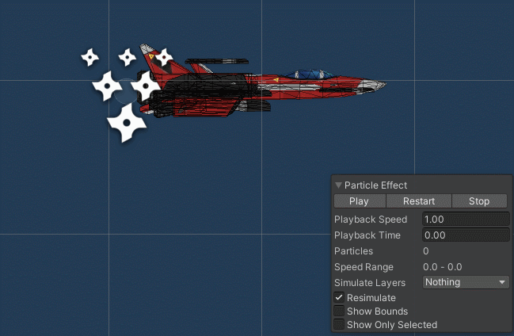
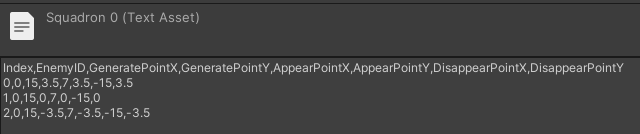

# Fast_Campus_Study
  Learning on a Fast_Campus

___
## 깨달은점
  - 메서드가 굉장히 많다.
  - 하나만 싱글톤화 하고 거기에 끌어와서 사용한다.
  - 이름이 굉장히 길다.
  - 상속받는 개념 사용 시 Update는 한번만 사용한다.
___
## __02.27__
> **<h3>Today Dev Story</h3>**
  - __배경의 이동__
    -  
    - Render의 OffsetX를 활용해서 배경의 전환 구현 
      <details>
      <summary>코드 보기</summary>

      ```c#
      
      [System.Serializable]   //직렬화
      public class BGScrollData
      {
        public Renderer RenderForScroll;    //Material임
        public float Speed;
        public float OffsetX;
      }

      public class BGScroller : MonoBehaviour
      {
        [SerializeField]
        BGScrollData[] ScrollDatas;

        private void FixedUpdate()
        {
          UpdateScroll();
        }

        void UpdateScroll()
        {
          for (int i = 0; i < ScrollDatas.Length; i++)
          {
            SetTextureOffset(ScrollDatas[i]);
          }
        }

        void SetTextureOffset(BGScrollData scrollData)
        {
          scrollData.OffsetX += (float)(scrollData.Speed) * TimefixedDeltaTime;
        
          if (scrollData.OffsetX > 1) //혹시 모를 오류 방지
          {
            scrollData.OffsetX = scrollData.OffsetX % 1.0f;
          }

          Vector2 Offset = new Vector2(scrollData.OffsetX, 0);
          scrollData.RenderForScroll.material.SetTextureOffset("_MainTex", Offset);   //_MainTex 는 프로퍼티 이름 
        }
      }
      
      ```

      </details>
  
  - __Player의 이동__
    -   
    - Vector3를 사용하여 Player 이동 구현
    - 해당 키가 눌리면 transform.postion을 조작
     
      <details>
      <summary>코드 보기</summary>

      ```c#
      //SystemManager.cs 에서 Player 접근가능 (싱글톤)
      [SerializeField]
      Player player;

      public Player Hero  //접근 프로퍼티
      {
        get { return player; }
      }

      //inputController.cs 에서 SystemManager을 통해 Player에 접근
      void UpateInput()
      {
        Vector3 moveDirection = Vector3.zero;
        if(Input.GetKey(KeyCode.W) || Input.GetKey(KeyCode.UpArrow))
        {
            moveDirection.y = 1;
        }
        ...
        ...
        ...
        SystemManager.Instance.Hero.ProcessInput(moveDirection);  //함수 실행
      }
      ```
      </details> 

    - 이동제한 구현
    - 배경의 localScale과 플레이어의 Postion,Colider를 이용하여 판단
      <details>
      <summary>코드 보기</summary>

      ```c#
      Vector3 AdjustMoveVector(Vector3 moveVector)  
      {
        Vector3 result = Vector3.zero;
        result = boxCollider.transform.position + moveVector;   //곧 Player의 위치

        if(result.x - boxCollider.size.x * 0.5f < -MainBGQuadTransform.localScale.x * 0.5f)
        {
            moveVector.x = 0;
        }
        if (result.x + boxCollider.size.x * 0.5f > MainBGQuadTransform.localScale.x * 0.5f)
        {
            moveVector.x = 0;
        }
        if (result.y - boxCollider.size.y * 0.5f < -MainBGQuadTransform.localScale.y * 0.5f)
        {
            moveVector.y = 0;
        }
        if (result.y + boxCollider.size.y * 0.5f > MainBGQuadTransform.localScale.y * 0.5f)
        {
            moveVector.y = 0;
        }

        return moveVector;
      }
      ```
      </details> 
  
  - __Enemy 클래스 제작__
    -  
    - 상태에 따른 행동 구현 
    - 행동별로 메서드를 구분하여 접근하기 쉽게 제작
      <details>
      <summary>코드 보기</summary>

      ```c#
      public enum State : int //int 상속
      {
        None = -1,  //사용전
        Ready = 0,  //준비완료
        Appear,     //등장
        Battle,     //전투중
        Dead,       //사망
        Disapper,   //퇴장
      }

      [SerializeField]
      State CurrentState = State.None;    //현재 상태

      const float MaxSpeed = 10.0f;       //변하지 않는 속도 값(가속을 이용할껀디)
      const float MaxSpeedTime = 0.5f;    //가속 시간

      [SerializeField]
      Vector3 TargetPostion;  //현재 목표로인 위치

      [SerializeField]
      float CurrentSpeed;     //현재 속도

      Vector3 CurrentVelocity;
      float MoveStartTime = 0.0f; //움직이기 시작한 시간 --> 속도를 점점 증가 시키기 위함

      //시간의 흐름을 측정하기 위함
      float BattleStartTime = 0.0f;   //

      void FixedUpdate()
      {
        if(Input.GetKeyDown(KeyCode.L)) //적의 등장
        {
          Appear(new Vector3(7,transform.position.y,transform.position.z));
        }

        switch(CurrentState)    //현재 상태에 따른 행동들
        {
          case State.None:
          case State.Ready:
            break;

          case State.Dead:
            break;

          case State.Appear:
          case State.Disapper:
            UpdateSpeed();
            UpdateMove();
            break;

          case State.Battle:
            UpdateBattle();
            break;

          default:
            break;
        }
      }

      void UpdateSpeed()  //속도의 갱신
      {
        CurrentSpeed = Mathf.Lerp(CurrentSpeed,MaxSpeed, (Time.time - MoveStartTime)/MaxSpeedTime);    //두 값 사이의 어딘가를 반환
      }

      void UpdateMove()   //이동
      {
        float distance = Vector3.Distance(TargetPostion, transform.position);   //타겟까지의 거리
        if (distance == 0)  //도착 판단
        {
          Arrived();
          return;
        }
        CurrentVelocity = (TargetPostion - transform.position).normalized * CurrentSpeed; //초당 방향 벡터(크키 1)

        //실질적으로 이동하는 부분 --> 속도 = 거리/시간
        transform.position = Vector3.SmoothDamp(transform.position, TargetPostion, ref CurrentVelocity, distance/CurrentSpeed, MaxSpeed);   //자연스럽게 이동
      }
      void Arrived()      //도착 알림
      {
        CurrentSpeed = 0;
        if (CurrentState == State.Appear)
        {
          CurrentState = State.Battle;
          BattleStartTime = Time.time;    //배틀 시작 시간
        }
        else //if (CurrentState == State.Disapper)
        {
          CurrentState = State.None;
        }
      }
      public void Appear(Vector3 targetPos)   //등장
      {
        TargetPostion = targetPos;
        CurrentSpeed = MaxSpeed;

        CurrentState = State.Appear;
        MoveStartTime = Time.time;
      }
      void Disapper(Vector3 targetPos)    //소멸
      {
        TargetPostion = targetPos;
        CurrentSpeed = 0;

        CurrentState = State.Disapper;
        MoveStartTime = Time.time;
      }
      void UpdateBattle() 
      {
        if(Time.time - BattleStartTime > 3f)
        {
          Disapper(new Vector3(-15,transform.position.y,transform.position.z));
        }
      }
      ```
      </details> 

> **<h3>Realization</h3>**
  - Vector3.sqrMagnitude 
    - 해당 벡터의 값이 모두 0인지 확인
  - 매개변수에 ref,out 키워드
    - 복사된 값을 넘겨주는 것이므로 실제 값에는 영향이 없다.
    - call by refernce (참조객체)
      - ref : 이미 초기화가 끝난 상태여야 함, 외부에서 내부로 값을 전달시 사용
      - out : 초기화 안해도 상괍 없음   
___
## __03.03__
> **<h3>Today Dev Story</h3>**
  - ### __플레이어와 적기 사이의 충돌 감지__
    - OnTriggerEnter(Collider other)를 사용해서 부딪치는 오브젝트를 감지
      <details>
      <summary>코드 보기</summary>

      ```c#
      private void OnTriggerEnter(Collider other) //상대방의 정보가 나온다.
      {
        Player player = other.GetComponentInParent<Player>(); //부딪친거는 박스 콜라이더니까 상위인 부모 호출
        if (player)
        {
            player.OnCrash(this);   
        }
      }

      public void OnCrash(Player player)    //내가 부딪친거
      {
        Debug.Log("OnCrash player = " + player);
      }
      ```
      </details>   
  - ### __EnemyFactory 생성__
    - Prefabs과 Instantiate 사용 
    - Enemy Prefab을 Dictionary의 키로 사용하여 캐싱
    - 굳이 이렇게 하는 이유를 모르겠다.
      <details>
      <summary>코드 보기</summary>

      ```c#
      public const string EnemyFath = "Prefabs/Enemy";

      //프리팹을 키로 사용하여 캐싱
      Dictionary<string, GameObject> EnemyFileCache = new Dictionary<string, GameObject>();

      public GameObject Load(string resourcePath)
      {
        GameObject go = null;

        if (EnemyFileCache.ContainsKey(resourcePath))        //이미 로드되어있는 경우
        {
          go = EnemyFileCache[resourcePath];    //메모리 상에 올라와 있는 것을 가져온다.
        }
        else     
        {
          go = Resources.Load<GameObject>(resourcePath);  //프리팹을 메모리에 로드한다.
          if (!go)
          {
            Debug.LogError("Load Error! path = " + resourcePath);
            return null;
          }

          EnemyFileCache.Add(resourcePath, go);
        }

        GameObject instancedGo = Instantiate<GameObject>(go);

        return instancedGo;
      }
      ```
      </details>
  - ### __EnemyManager 생성__
    - EnemyFactory과 연동하여 Enemy의 생성에 직접적으로 관여한다. 
    - List를 사용하여 모든 Enemy들을 관리
      <details>
      <summary>코드 보기</summary>

      ```c#
      [SerializeField]
      EnemyFactory enemyFactory;

      List<Enemy> enemies = new List<Enemy>();

      private void Update()
      {
        if (Input.GetKeyDown(KeyCode.L)) //적의 등장
        {
            GenerateEnemy(new Vector3(15, 0, 0));
        }
      }

      public bool GenerateEnemy(Vector3 position)
      {
        GameObject go = enemyFactory.Load(EnemyFactory.EnemyFath);  //프리펩 호출
        if(go == null)
        {
          Debug.LogError("GenerateEnemy Error!");
          return false;
        }
        go.transform.position = position;

        Enemy enemy = go.GetComponent<Enemy>(); 
        enemy.Appear(new Vector3(7, 0, 0));

        enemies.Add(enemy);
        return true;
      }
      ```
      </details>
> **<h3>Realization</h3>**
  - ### __OnTriggerEnter()메서드 사용__
    - istrigger 체크 되어있는 것만 해당 
  - ### __자료구조__
    - 
    - Dictionary
      - 큐, 스택같은 개념  
      - 사용자가 원하는데로 키를 설정할 수 있다.  int형뿐만 아니라 문자열이나 다양한 변수형도 가능하다.
    - List
      - 비슷하게 활용된다.
___
## __03.05__
> **<h3>Today Dev Story</h3>**
  - ### __Bullet 클래스 제작__
    - 총알 관련 클래스 제작
    - 누가 발사 했는지 enum으로 다른 클래스 제작
      <details>
      <summary>코드 보기</summary>
      
      ```c#
      public enum OwnerSide : int
      {
        Player = 0,
        Enemy
      }

      public class Bullet : MonoBehaviour
      {
        OwnerSide ownerSide = OwnerSide.Player;

        [SerializeField]
        Vector3 MoveDirection = Vector3.zero;

        [SerializeField]
        float Speed = 0.0f;

        bool NeedMove = false;  //이동이 필요한지

        private void FixedUpdate()
        {
          UpdateMove();
        }

        void UpdateMove()
        {
          if (!NeedMove)
            return;

          Vector3 moveVector = MoveDirection.normalized * Speed * Time.deltaTime;

          transform.position += moveVector;
        }

        public void Fire(OwnerSide FireOwner, Vector3 firePostion, Vector3 direction, float speed, int damage)  //외부에서 접근
        {
          ownerSide = FireOwner;
          transform.position = firePostion;
          MoveDirection = direction;
          Speed = speed;
          Damage = damage;

          NeedMove = true;
          FireTime = Time.time;
        }
      }
      ```
      </details> 

  - ### __마우스를 활요한 발사__
    - 
    - InputController에서 SystemManager의 Player 접근 프로퍼티를 사용해서 Player의 Fire()함수 실행 
      <details>
      <summary>코드 보기</summary>

      ```c#
      void UpdateMouse()
      {
        if(Input.GetMouseButtonDown(0))
        {
            SystemManager.Instance.Hero.Fire();
        }
      }
      ```
      </details> 
  - ### __Enemy도 총알 발사__
    - 
    - 지정된 발사 횟수가 넘으면 사라진다.
      <details>
      <summary>코드 보기</summary>
      
      ```c#
      void UpdateBattle() 
      {
        if(Time.time - LastBattleUpdateTime > 1f)
        {
          if (FireRemainCount > 0)
          {
            Fire();
            FireRemainCount--;
          }
          else
          {
            Disapper(new Vector3(-15, transform.position.y, transform.position.z));
          }
          LastBattleUpdateTime = Time.time;
        }
      }
      ``` 
      </details>  
  - ### __Bullet의 소멸__
    - 
    - 시간과 포지션의 위치에 따라 사라진다. 총 2가지 조건
      <details>
      <summary>코드 보기</summary>
      
      ```c#
      bool ProcessDisapperCondition() //총알의 파괴
      {
        if(transform.position.x > 15f || transform.position.x < -15f || transform.position.y > 15f || transform.position.y < -15f) //거리
        {
            Disapper();
            return true;
        }
        else if(Time.time - FireTime > LifeTime) //시간
        {
            Disapper();
            return true;
        }
        return false;
      }

      void Disapper()
      {
        Destroy(gameObject);
      }
      ``` 
      </details>  

  - ### __피격시 HP 감소 처리__
    - Actor 클래스 추가 -> Player와 Enemy가 공통으로 상속
    - Bullet의 피해량 변수 제작
    - 총알, 기체 피격 시, 체력감소, 사망 메서드 추가
    - 공격자가 누구인지 사망 메서드까지 Actor 인자 전달
    - OwnerSide 제거 (Bullet.cs)
    - Enemy 클래스에 점수 추가
      <details>
      <summary>코드 보기</summary>
      
      ```c#
      //Actor
      public class Actor : MonoBehaviour
      {
        [SerializeField]
        protected int MaxHP = 100;  //체력

        [SerializeField]
        protected int CurrentHP;    //현재 체력

        [SerializeField]
        protected int Damage = 1;   //총알 데미지

        [SerializeField]
        protected int crashDamage = 100;    //충돌 데미지

        private bool isDead = false;

        public bool IsDead
        {
          get { return isDead; }
        }

        protected int CrashDamage
        {
          get { return crashDamage; }
        }

        private void Start()
        {
          Initialize();
        }

        protected virtual void Initialize()
        {
          CurrentHP = MaxHP;
        }

        private void Update()
        {
          UpdateActor();
        }
        protected virtual void UpdateActor()
        {

        }

        public virtual void OnBulletHited(Actor attacker, int damage)   //총알에 피격시
        {
          Debug.Log("OnBulletHited damage = " + damage);
          DecreaseHP(attacker,damage);
        }

        public virtual void OnCrash(Actor attacker,int damage)     //기체에 피격시
        {
          Debug.Log("OnCrash damage = " + damage);
          DecreaseHP(attacker,damage);
        }

        private void DecreaseHP(Actor attacker, int value)  //체력 감소 (외불 호출 X)
        {
          if (isDead)
            return;

          CurrentHP -= value;

          if (CurrentHP < 0)
            CurrentHP = 0;

          if (CurrentHP == 0)
            OnDead(attacker);
        }

        protected virtual void OnDead(Actor killer)
        {
          Debug.Log(name + "OnDead");
          isDead = true;
        }
      }

      //Bullet.cs --> 충돌 수정  OwnerSide 수정
      void OnBulletCollision(Collider collider)   //Bullet이 어디가에 닿았을때
      {
        //중복충돌방지
        if (Hited)
            return;

        //총알끼리 충돌방지
        if (collider.gameObject.layer == LayerMask.NameToLayer("EnemyBullet") || collider.gameObject.layer == LayerMask.NameToLayer("PlayerBullet"))        //Layer를 int형으로 가져올수 있다.
        {
          return;
        }

        Actor actor = collider.GetComponentInParent<Actor>();   //이거 뭔지봐보바봐보바ㅗ바ㅗ바봐
        if (actor && actor.IsDead)
            return;

        actor.OnBulletHited(Owner, Damage);


        Collider myCollider = GetComponentInChildren<Collider>();
        myCollider.enabled = false;

        Hited = true;
        NeedMove = false;

        Disapper();
      }

      //Enemy.cs -> 점수 추가
      protected override void OnDead(Actor killer)
      {
        base.OnDead(killer);

        SystemManager.Instance.GamePointAccumulator.Accumulate(GamePoint);

        CurrentState = State.Dead;
      }
      ```
      </details>  

  - ### __게임 점수를 관리하기 위한 클래스 제작__
    - GamePointAccumulator.cs --> MonoBehaviour 상속 X
      <details>
      <summary>코드 보기</summary>
      
      ```c#
      public class GamePointAccumulator
      {
        int gamePoint = 0;

        public int GamePoint
        {
          get { return gamePoint; }
        }
    
        public void Accumulate(int value)
        {
          gamePoint += value;
        }
        public void Reset()
        {
          gamePoint = 0;
        }
      }
      ```
      </details>  
> **<h3>Realization</h3>**
  - Input.GetMouseButtonDown(n)
    - 0 : 왼쪽, 1 : 오른쪽, 2 : 가운데  
  - 충돌감지(총알)시 필요한 것
    - Layer 추가
    - Physics/Layer Collision Matrix
      - collider 끼리의 충돌을 관리 할때
  - DontDestroyOnLoad(gameObject) : 오브젝트가 씬이 전환되어도 파괴되지 않는다.
  - LayCast : 끝이 없는 레이저
  - LineCast : 끝이 존재하는 레이저    
___
## __03.07__
> **<h3>Today Dev Story</h3>**
  - ### 엔진 출력 효과 제작
    - Particle 사용, Enemy와 Player 모두 제작 (색상차이)
    - 
  - ### 폭발 효과 추가 
    - 
    - EffectManager 생성
      - Effect들을 담아두고 Instantiate하는 곳
        <details>
        <summary>코드 보기</summary>
      
        ```c#
        public class EffectManager : MonoBehaviour
        {
          [SerializeField]
          GameObject[] effectPrefabs;

          public GameObject GenerateEffect(int index, Vector3 position)   //생성
          {
            if(index < 0 || index > effectPrefabs.Length)
            {
              Debug.LogError("GenerateEffect error! out of range! index = " + index);
              return null;
            }
            GameObject go = Instantiate<GameObject>(effectPrefabs[index], position, Quaternion.identity);

            return go;
          }
        }
        ```
        </details>

    - bullet과 Actor에 Effect 호출추가
      - 피격효과 추가
      - SystemManager를 통한 호출
        <details>
        <summary>코드 보기</summary>
      
        ```c#
        //OnBulletCollision 메서드
        GameObject go = SystemManager.Instance.EffectManager.GenerateEffect(0, transform.position);
        go.transform.localScale = new Vector3(0.2f, 0.2f, 0.2f);
      
        //Actor OnDead()메서드
        protected virtual void OnDead(Actor killer)
        {
          Debug.Log(name + "OnDead");
          isDead = true;

          SystemManager.Instance.EffectManager.GenerateEffect(1, transform.position);
        }
        ```
        </details> 

  - ### 오브젝트풀링
    - 
    - 하나의 프리펩 캐시 시스템 제작 후 다른 클래스를 인스턴스화 해서 사용
      ```c#
      PrefabsCacheData EffectCacheData = new PrefabsCacheData;
      PrefabsCacheData EnemyCacheData = new PrefabsCacheData;
      ...
      ```
    - instantiate 부하를 줄이기 위함
    - Enemy, Bullet, Effect 총 3가지 구현, MonoBehaviour를 상속 X
    - __PrefabCacheSystem__ 작성
      - 모든 오브젝트풀링을 관리하는 곳 
        <details>
        <summary>코드 보기</summary>
        
        ```c#
        //PrefabCacheSystem.cs
        [System.Serializable]
        public class PrefabsCacheData   //prefab의 데이터 ->총알,몬스터 등등
        {
          public string filePath;
          public int cacheCount;
        }

        public class PrefabCacheSystem 
        {
          Dictionary<string, Queue<GameObject>> Caches = new Dictionary<string, Queue<GameObject>>(); //이중 저장 여러가지의 타입

          public void GenerateCache(string filePath,GameObject gameObject, int cacheCount)    //초기 생성
          {
            if (Caches.ContainsKey(filePath))
            {
              Debug.Log("Already cache generated! filePath = " + filePath);
              return;
            }
            else
            {
              Queue<GameObject> queue = new Queue<GameObject>();
              for (int i = 0; i < cacheCount; i++)
              {
                GameObject go = Object.Instantiate<GameObject>(gameObject); //object에 있음 Bemonohavor를 상속하지 않아서
                go.SetActive(false);
                queue.Enqueue(go);  //넣어준다.
              }

              Caches.Add(filePath, queue);
            }
          }

          public GameObject Archive(string filePath)  //할당
          {
            if (!Caches.ContainsKey(filePath))  //키값이 없을때
            {
              Debug.LogError("Archive Error! no Cache Generated! FilePath = " + filePath);
              return null;
            }
        
            if(Caches[filePath].Count == 0) //생성된 수가 0개 일때
            {
              Debug.LogError("Archive problem! not Enough Count!");
              return null;
            }

            GameObject go = Caches[filePath].Dequeue(); //정보들을 넘긴다.
            go.SetActive(true);

            return go;
          }

          public bool Restore(string filePath, GameObject gameObject) //반납
          {
            if (!Caches.ContainsKey(filePath))
            {
              Debug.LogError("Restore Error! no Cache Generated! FilePath = " + filePath);
              return false;
            }

            gameObject.SetActive(false);

            Caches[filePath].Enqueue(gameObject);   
            return true;
          }
        }
        ```
        </details> 
    - ### __Enemy__ 캐싱
      - EnemyManager.cs에 캐시 정보 추가 및 Instantitate 삭제
      - EnemyFactory 에서는 적재만 진행
        <details>
        <summary>코드 보기</summary>
        
        ```c#
        //EnemyManager.cs
        [SerializeField]
        PrefabsCacheData[] enemyFiles;  //배열로 생성

        private void Start()
        {
          Prepare();
        }

        private void Update()
        {
          if (Input.GetKeyDown(KeyCode.L)) //적의 등장
          {
            GenerateEnemy(0, new Vector3(15, 0, 0));
          }
        }

        public bool GenerateEnemy(int index,Vector3 position)   //만들어줘라
        {
          string filePath = enemyFiles[index].filePath;
          GameObject go = SystemManager.Instance.EnemyCacheSystem.Archive(filePath);  //프리펩 호출

          go.transform.position = position;

          Enemy enemy = go.GetComponent<Enemy>();
          enemy.FilePath = filePath;
          enemy.Appear(new Vector3(7, 0, 0));

          enemies.Add(enemy);
          return true;
        }

        public bool RemoveEnemy(Enemy enemy)    //삭제해라
        {
          if (!enemies.Contains(enemy))   //키값이 아니라 이 오브젝트가 없다면
          {
            Debug.LogError("No exist Enemy");
            return false;
          }
          enemies.Remove(enemy);
          SystemManager.Instance.EnemyCacheSystem.Restore(enemy.FilePath, enemy.gameObject);

          return true;
        }

        public void Prepare()   //초기 단체 생성
        {
          for (int i = 0; i < enemyFiles.Length; i++)
          {
            GameObject go = enemyFactory.Load(enemyFiles[i].filePath);
            SystemManager.Instance.EnemyCacheSystem.GenerateCache(enemyFiles[i].filePath, go, enemyFiles[i].cacheCount);
          }
        }
        ```
        </details> 

    - ### __Bullet__ 캐싱
      - 
      - Player, Enemy 링크 제거, 파일로 로드
      - EnemyManager와 비슷
      - BulletManager 생성, Bullet에 FilePath 추가, Player,Enemy의 발사 수정
        <details><summary>코드 보기</summary>
        
        ```c#
        //BulletManager.cs
        public const int PlayerBulletIndex = 0;
        public const int EnemyBulletIndex = 1;

        //캐싱관련
        [SerializeField]
        PrefabsCacheData[] bulletFiles;

        Dictionary<string, GameObject> FileCache = new Dictionary<string, GameObject>();

        private void Start()
        {
          Prepare();
        }

        public GameObject Load(string resourcePath) //EnemyFactory의 Load와 유사
        {
          GameObject go = null;

          if (FileCache.ContainsKey(resourcePath)) //캐시가 있다면
          {
            go = FileCache[resourcePath];
          }
          else        //캐시가 없다면 
          {
            go = Resources.Load<GameObject>(resourcePath);
            if (!go)
            {
              Debug.LogError("Load Error! path = " + resourcePath);
              return null;
            }
            FileCache.Add(resourcePath, go);
          }
          return go;
        }

        public void Prepare()
        {
          for (int i = 0; i < bulletFiles.Length; i++)
          {
            GameObject go = Load(bulletFiles[i].filePath);
            SystemManager.Instance.BulletCacheSystem.GenerateCache(bulletFiles[i].filePath, go, bulletFiles[i].cacheCount);
          }
        } 

        public Bullet Generate(int index)
        {
          string filePath = bulletFiles[index].filePath;
          GameObject go = SystemManager.Instance.BulletCacheSystem.Archive(filePath);

          Bullet bullet = go.GetComponent<Bullet>();
          bullet.FilePath = filePath;

          return bullet;
        }

        public bool Remove(Bullet bullet)
        {
          SystemManager.Instance.BulletCacheSystem.Restore(bullet.FilePath, bullet.gameObject);
          return true;
        }
        ```
        ```c#
        //Player의 총알 발사
        public void Fire()
        {
          Bullet bullet = SystemManager.Instance.BulletManager.Generate(BulletManager.PlayerBulletIndex);
          bullet.Fire(this, FireTransform.position, FireTransform.right, BulletSpeed, Damage);
        }
        ```
        </details>  
       
    - ### __Effect__ 캐싱
      - AutoCachableEffect.cs 생성 -> Effect가 끝나면 소멸(반납)
        <details>
        <summary>코드 보기</summary>

        ```c#
        [RequireComponent(typeof(ParticleSystem))]
        public class AutoCachableEffect : MonoBehaviour
        {
          public string FilePath
          {
            get; set;
          }

          private void OnEnable()
          {
            StartCoroutine("CheckIfAlive");
          }

          IEnumerator CheckIfAlive()  
          {
            while (true)
            {
              yield return new WaitForSeconds(0.5f);
              if (!GetComponent<ParticleSystem>().IsAlive(true))  //끝났다면 종료하기 위함
              {
                SystemManager.Instance.EffectManager.RemoveEffect(this);
                break;
              }
            }
          }
        }
        ```
        </details>  
      - EffectManager 수정
        - [Bullet Manager와 유사](#Bullet-캐시)

> **<h3>Realization</h3>**
  - Particle System
    - 임펙트를 만드는데 사용되는 컴포넌트
___
## __03.08__
> **<h3>Today Dev Story</h3>**
  - uGUI로 정보 표현
    - Player HP 표현
      - 
      - Slider 사용, Gage.cs 생성
      - Actor 수정(DecreaseHP()를 virtual로) 
        <details>
        <summary>코드 보기</summary>

        ```c#
        public class Gage : MonoBehaviour
        {
          [SerializeField]
          Slider slider;

          public void SetHP(float currentValue, float MaxValue)
          {
            if (currentValue > MaxValue)
              currentValue = MaxValue;

            slider.value = currentValue / MaxValue;
          }
        }
        ```
        </details>   
    - 패널,매니저 클래스 제작
      - BasePanel 클래스 (상위 클래스)
      - 상속 받은 Panel들은 Awake,OnDestory 메서드를 사용해서는 안된다. 또한 자동으로 Dictionary에 저장된다. 호출시 PanelManager에서 호출하여 사용한다.
        <details><summary>코드 보기</summary>

        ```c#
        private void Awake()
        {
          InitializePanel();
        }

        private void OnDestroy()    //파괴될때
        {
          DestroyPanel();
        }

        private void OnGUI()    //매프레임 호출
        {
          if (GUILayout.Button("Close"))  //버튼생성과 동시에 버튼을 누른다면
          {
            Close();
          }
        }
        public virtual void InitializePanel()   //초기 생성
        {  
          PanelManager.RegistPanel(GetType(), this);
        }
        public virtual void DestroyPanel()  //삭제
        { 
          PanelManager.UnregistPanel(GetType());  //GetType 쓰면 자식이 나온다.
        }
        public virtual void Show()
        {
          gameObject.SetActive(true);
        }
        public virtual void Close()
        {
          gameObject.SetActive(false);
        }
        ```
        </details> 

      - PanelManager 생성
        - Canvas에 배치
        - Panel들을 저장하고 관리 
          <details><summary>코드 보기</summary>

          ```c#
          public class PanelManager : MonoBehaviour
          {
            //패널들을 저장
            static Dictionary<Type, BasePanel> Panels = new Dictionary<Type, BasePanel>();

            //패널 등록
            public static bool RegistPanel(Type PanelClassType, BasePanel basePanel)
            {
              if (Panels.ContainsKey(PanelClassType)) //같은 타입의 창은 존재하지 않는다.
              {
                Debug.LogError("RegistPanel Error! Already exist Type! PanelClassType = " + PanelClassType.ToString());
                return false;
              }

              Debug.Log("RegistPanel is called! Type = " + PanelClassType.ToString() + ", basePanel" + basePanel.name);

              Panels.Add(PanelClassType, basePanel);
              return true;
            }

            public static bool UnregistPanel(Type PanelClassType)   //삭제
            {
              if (!Panels.ContainsKey(PanelClassType))
              {
                Debug.LogError("UnregistPanel Error! Can't Found Type! PanelClassType = " + PanelClassType.ToString());
                return false;
              }

              Panels.Remove(PanelClassType);  //Dictionary 내부 함수
              return true;
            }

            public static BasePanel GetPanel(Type PanelClassType)   //추출
            {
              if (!Panels.ContainsKey(PanelClassType))
              {
                Debug.LogError("GetPanel Error! Can't Found Type! PanelClassType = " + PanelClassType.ToString());
                return null;
              }

              return Panels[PanelClassType];  //타입의 이름으로 호출
            }
          }
          ```
          ```c#
          //이렇게 사용한다.
          PlayerStatePanel playerStatePanel = PanelManager.GetPanel(typeof(PlayerStatePanel)) as PlayerStatePanel;
          playerStatePanel.SetHP(CurrentHP, MaxHP);
          ```
          </details>  
> **<h3>Realization</h3>**
  - GUI
    - 레거시 UI : 기본 UI, 코드에 의해 사용
    - ezGUI : 오래된 라이브러리, 구매를 해야했음
    - NGUI : 외부 라이브러리, 구매를 해야했음
    - uGUI : 유니티에서 제공하는 UI
      - Panel 단위로 구성하면 관리에 용이
      - RectTransform 사용
      - Anchor Presets 사용아형 간편하게 정렬
    - Panel
      - 창의 공통적인 동작을 구현한 클래스를 만들어서 사용하고 상속 
  - GetType() : 나의 타입을 반환한다.
___
## __03.09__
> **<h3>Today Dev Story</h3>**
  - ### PlayerStatePanel 작성
    - 
    - BasePanel을 상속
    - 점수와 HP를 표시 (Player, GamePointAccumulator 수정)
    - Panel이니까 PanelManager에서 GetPanel을 호출하여 사용
      <details><summary>코드 보기</summary>

      ```c#
      public class PlayerStatePanel : BasePanel
      {
        [SerializeField]
        Text scoreValue;

        [SerializeField]
        Gage HPGage;

        public void SetScore(int value)     //점수 설정
        {
          Debug.Log("SetScore value = " + value);

          scoreValue.text = value.ToString();
        }

        public void SetHP(float currentValue, float maxValue)   //HP설정
        {
          HPGage.SetHP(currentValue, maxValue);
        }
      }
      ```
      ```c#
      //이렇게 사용한다.
      PlayerStatePanel playerStatePanel = PanelManager.GetPanel(typeof(PlayerStatePanel)) as PlayerStatePanel;
      playerStatePanel.SetScore(gamePoint);
      ```
      </details>
  - ### 총알 데미지 화면에 표시
    - 
    - DamageManager, SystemManager에 DamageCacheSystem 추가 
      
      <details><summary>코드 보기</summary>

      ```c#
      public class DamageManager : MonoBehaviour
      {
        //추후 수정
        public const int EnemyDamageIndex = 0;
        public const int PlayerDamageIndex = 0;

        [SerializeField]
        Transform canvasTransform;

        [SerializeField]
        Canvas canvas;

        [SerializeField]
        PrefabsCacheData[] Files;

        Dictionary<string, GameObject> FileCache = new Dictionary<string, GameObject>();

        void Start()
        {
          Prepare();
        }
        
        public GameObject Load(string resourcePath)     //동일
        {
          GameObject go = null;
          if (FileCache.ContainsKey(resourcePath))
          {
            go = FileCache[resourcePath];
          }
          else
          {
            go = Resources.Load<GameObject>(resourcePath);
            if (!go)
            {
              Debug.LogError("Load Error! path : " + resourcePath);
              return null;
            }

            FileCache.Add(resourcePath, go);
          }
          return go;
        }

        public void Prepare()
        {
          for (int i = 0; i < Files.Length; i++)
          {
            GameObject go = Load(Files[i].filePath);
            SystemManager.Instance.DamageCacheSystem.GenerateCache(Files[i].filePath, go, Files[i].cacheCount, canvasTransform);
          }
        }

        public GameObject Generate(int index, Vector3 position, int damageValue)
        {
          if (index < 0 || index >= Files.Length)
          {
            Debug.LogError("Generate Error! out of range! index = " + index);
            return null;
          }
          string filePath = Files[index].filePath;
          GameObject go = SystemManager.Instance.DamageCacheSystem.Archive(filePath);
          go.transform.position = Camera.main.WorldToScreenPoint(position);
          //go.transform.position = position;

          UIDamage damage = go.GetComponent<UIDamage>();
          damage.FilePath = filePath;
          damage.ShowDamage(damageValue);

          return go;
        }

        public bool Remove(UIDamage damage)
        {
          SystemManager.Instance.DamageCacheSystem.Restore(damage.FilePath, damage.gameObject);
          return true;
        }
      }
      ```
      ```c#
      //PrefabCacheSystem.cs
      public void GenerateCache(string filePath,GameObject gameObject, int cacheCount, Transform parentTransform = null);
      
      //Player.cs -> DecraseHP
      SystemManager.Instance.DamageManager.Generate(DamageManager.PlayerDamageIndex, transform.position + Random.insideUnitSphere * 0.5f, value);
      ```
      </details> 

    - UIDamage.cs, 프리펩 생성(Canvas에서 생성)
      
      <details><summary>코드 보기</summary>

      ```c#
      public class UIDamage : MonoBehaviour
      {
        enum DamageState : int
        {
          None = 0,
          SizeUp,
          Display,
           FadeOut
        }

        [SerializeField]
        DamageState damageState = DamageState.None;

        //각 시간 진행기간
        const float SizeUpDuration = 0.1f;
        const float DisplayDuration = 0.5f;
        const float FadeOutDuration = 0.2f;

        [SerializeField]
        Text damageText;    

        Vector3 CurrentVelocity;    //SmoothDamp 사용시 사용

        //시작 시간 저장용
        float DisplayStartTime;
        float FadeOutStartTime;
          
        public string FilePath
        {
          get; set;
        }

        private void Update()
        {
          UpdateDamage();
        }

        private void OnGUI()
        {
          if (GUILayout.Button("Show"))
          {
            ShowDamage(9999);
          }
        }

        public void ShowDamage(int damage)
        {
          damageText.text = damage.ToString();
          Reset();
          damageState = DamageState.SizeUp;   //보여지기 시작
        }

        void Reset()
        {
          transform.localScale = Vector3.zero;    //사이즈가 0
          Color newColor = damageText.color;
          newColor.a = 1.0f;                      //투명도 1
          damageText.color = newColor;
        }
        
        void UpdateDamage()
        {
          if (damageState == DamageState.None)
            return;

          switch (damageState)
          {
            case DamageState.SizeUp:
              transform.localScale = Vector3.SmoothDamp(transform.localScale, Vector3.one, ref CurrentVelocity, SizeUpDuration);

              if(transform.localScale == Vector3.one)
              {
                damageState = DamageState.Display;
                DisplayStartTime = Time.time;
              }
              break;
            case DamageState.Display:
              if(Time.time - DisplayStartTime > DisplayDuration)
              {
                damageState = DamageState.FadeOut;
                FadeOutStartTime = Time.time;
              }
              break;
            case DamageState.FadeOut:
              Color newColor = damageText.color;
              newColor.a = Mathf.Lerp(1, 0, (Time.time - FadeOutStartTime) / FadeOutDuration);    //1~0으로 투명값 조절
              damageText.color = newColor;

              if (newColor.a == 0)
              {
                damageState = DamageState.None;
                SystemManager.Instance.DamageManager.Remove(this);
              }
              break;
          }
        }
      }
      ```
      </details>
       
    - PreFabCacheSystem의 GenerateCache인자를 부모 Transform을 받을 수 있도록 확장 후 전달 (캔버스 밑에 있기 때문에)
    - 캔버스는 3D 위치를 화면 위치로 해야함
    - DamageManager의 Generate 메소드에서 데미지 UI의 위치값을 넣어줄때 WorldToScreenPoint로 변환해서 넘겨줘야 정상적으로 출력된다. 
    - Player, Enemy의 DecreaseHp에서 사용
  
  - ### 데미지 출력 잔여 관리
    - 기타 등등 수정 
> **<h3>Realization</h3>** 
  - 3D 위치를 화면 위치
    - Camera.main.WorldToScreenPoint
  - Instantiate(오브젝트,위치)
  - Random.insideUnitSphere * 0.5f
    - 구체 반경 0.5인 곳의 점을 선택
___
## __03.10__
> **<h3>Today Dev Story</h3>**
  - ### 적 비행기 편대 비행 제작
    1. SquadronManager.cs 만들기
        - 
        - 일정 시간이 지나면 Squadron생성
        - 트리거 사용  
        - SquadronData 작성
          <details><summary>코드 보기</summary>
          
          ```c#
          [System.Serializable]
          public class SquadronData
          {
            public float SquadronGenerateTime;      //시간이 되면
            public Squadron squadron;               //이 스쿼드론 생성
          }

          public class SquadronManager : MonoBehaviour
          {
            float GameStartedTime;  //시작시간

            int SquadronIndex;      //몇개만들껀디

            [SerializeField]
            SquadronData[] squadronDatas;

            bool running = false;   //게임 실행중?

            private void Update()
            {
              if (Input.GetKeyDown(KeyCode.K))
              {
                StartGame();
              }
              CheckSquadronGeneratings();
            }

            public void StartGame() //게임 시작
            {
              GameStartedTime = Time.time;
              SquadronIndex = 0;
              running = true;
              Debug.Log("Game Started!");
            }

            void CheckSquadronGeneratings() //생성을 체크
            {
              if (!running)
                return;

              if(Time.time - GameStartedTime >= squadronDatas[SquadronIndex].SquadronGenerateTime)
              {
                GenerateSquadron(squadronDatas[SquadronIndex]);
                SquadronIndex++;

                if (SquadronIndex >= squadronDatas.Length)
                {
                  AllSquadronGenerated();
                  return;
                }
              }
            }
            void GenerateSquadron(SquadronData data)    //스쿼드론 생성(임시)
            {
              Debug.Log("GenerateSquadron");
            }
            void AllSquadronGenerated() //모든 스쿼드론 종료(임시)
            {
              Debug.Log("AllSquadronGenerated");

              running = false;
            }
          }
          ```
          </details> 
    2. Squadron  
        - EnemyGenerateDate 클래스 추가
        - GenerateAllData 메서드 추가  
> **<h3>Realization</h3>**   
  - null
___
## __03.11__
> **<h3>Today Dev Story</h3>**
  - ### 대형을 유지하는 적기 생성 
  -  
  - ### enemy 변경
    - Reset추가 (기존 설정 방식을 수정)
        <details><summary>코드 보기</summary>

        ```c#
        public void Reset(EnemyGenerateData data)
        {
          CurrentHP = MaxHP = data.MaxHp;
          Damage = data.Damage;
          crashDamage = data.CrashDamage;
          BulletSpeed = data.BulletSpeed;
          FireRemainCount = data.FireRemainCount;
          GamePoint = data.GamePoint;

          AppearPoint = data.AppearPoint;
          DisappearPoint = data.DisappearPoint;

          CurrentState = State.Ready;
          LastActionUpdateTime = Time.time;
        }
        ```
        </details> 
  - ### EnemyManager 수정
    - 기존생성이 삭제 Squadron에서 생성 
      <details><summary>코드 보기</summary>

      ```c#
      public bool GenerateEnemy(EnemyGenerateData data)   //만들어줘라
      {
        GameObject go = SystemManager.Instance.EnemyCacheSystem.Archive(data.FilePath);  //프리펩 호출

        go.transform.position = data.GeneratePoint;

        Enemy enemy = go.GetComponent<Enemy>();
        enemy.FilePath = data.FilePath;
        enemy.Reset(data);

        enemies.Add(enemy);
        return true;
      }
      ```
      </details> 
  - ### Squadron 수정
    -  
    - 각각의 스쿼드론을 관리
      <details><summary>코드 보기</summary>

      ```c#
      public class Squadron : MonoBehaviour
      {
        [SerializeField]
        EnemyGenerateData[] enemyGenerateDatas;

        void GenerateAllData()
        {
          for (int i = 0; i < enemyGenerateDatas.Length; i++)
          {
            SystemManager.Instance.EnemyManager.GenerateEnemy(enemyGenerateDatas[i]);
          }
        }
      }
      ```

      ```c#
      //SquadronManger.cs
      void GenerateSquadron(SquadronData data)    //스쿼드론 생성
      {
        Debug.Log("GenerateSquadron");
        data.squadron.GenerateAllData();
      }
      ```
      </`details> 
> **<h3>Realization</h3>**   
  - null
___
## __03.13__
> **<h3>Today Dev Story</h3>**
  - ### 엑셀 파일을 사용해서 적기를 생성
    - 
    - 아래에 나오는 모든 내용은 엑셀파일(.CSV)를 사용해 적기 편대화를 제작 후 호출하는 방법
  - ### CSV 파일 포맷
    - 엑셀 테이블 작성과 CSV 포맷 저장
    - 콤마(,)로 필드 값을 구분
    - TextAsset형태로 import 진행
  - ### Marshalling
    - 한 객체의 표현방식을 저장,전송에 적합한 데이터 형식으로 변환하는 과정
    - 이 기술을 활요해서 CSV 테이블의 레코드 문자열을 구조체로 변환 후 저장
    - 편하지만 빠르지 않다. runtime에는 사용 X
    - ex)serialize 
  - ### TableRecordParser 
    - 마샬링을 이용하여 레코드를 구조체로 변환
    - 자르고 바이트 단위로
    - MonoBehaviour 상속 X
      <details><summary>코드 보기</summary>
  
      ```c#
      using System;
      using System.Collections;
      using System.Collections.Generic;
      using System.Runtime.InteropServices;   //marshal을 위함
      using System.Reflection;                //marshal을 위함
      using System.Text;

      public class MarshalTableConstant   //string을 할당할때 사용할 변수
      {
        public const int charBufferSize = 256;
      }

      public class TableRecordParser<TMarshalStruct>  //Tamplit형
      {
        public TMarshalStruct ParseRecordLine(string line)  //record "한줄"을 읽어들일때 사용
        {
          //TMarshalStruct 크기에 맞춰서 Byte 배열 할당
          Type type = typeof(TMarshalStruct);
          int structSize = Marshal.SizeOf(type);      //System.Runtime.InteropServices.Marshal
          byte[] structBytes = new byte[structSize];  //여기에 저장
          int structBytesIndex = 0;

          //line 문자열을 spliter로 자른다.
          const string spliter = ",";
          string[] fieldDataList = line.Split(spliter.ToCharArray());
            
          //각 필드에 대한 정보
          Type dataType;
          string splited;
          byte[] fieldByte;
          byte[] keyBytes;

          FieldInfo[] fieldInfos = type.GetFields();      //System.Reflection.FieldInfo -> 필드에 대한 정보들이 배열로 반환
          for (int i = 0; i < fieldInfos.Length; i++)
          {
            dataType = fieldInfos[i].FieldType;
            splited = fieldDataList[i];

            fieldByte = new byte[4];    //32비트 기준
            MakeBytesByFieldType(out fieldByte, dataType, splited);

            //명시적으로 보인다. fieldByte의 값을 structBytes에 누적
            //for (int index = 0; index < fieldByte.Length; index++)
            //{
            //    structBytes[structBytesIndex++] = fieldByte[index];
            //}

            Buffer.BlockCopy(fieldByte, 0, structBytes, structBytesIndex, fieldByte.Length);    //한줄에
            structBytesIndex += fieldByte.Length;

            //첫번째 필드를 key값으로 사용하기 위해 백업
            if (i == 0)
            {
              keyBytes = fieldByte;
            }
          }
            //marshaling
            TMarshalStruct tStruct = MakeStructFromBytes<TMarshalStruct>(structBytes);  
            //AddData(keyBytes, tStruct);
            return tStruct;
        }

        /// <summary>
        /// 문자열 splite를 주어진 dataType에 맞게 fieldByte 배열에 변환해서 반환
        /// </summary>
        /// <param name="fieldByte">결과 값을 받을 배열</param>
        /// <param name="dataType">splite를 변환할때 사용될 자료형</param>
        /// <param name="splite">반환할 값이 있는 문자열</param>
        protected void MakeBytesByFieldType(out byte[] fieldByte, Type dataType, string splite)
        {
          fieldByte = new byte[1];

          if (typeof(int) == dataType)        //System.BitConverter
          {
            fieldByte = BitConverter.GetBytes(int.Parse(splite));   //바이틀 변환
          }
          else if (typeof(float) == dataType)
          {
            fieldByte = BitConverter.GetBytes(float.Parse(splite));
          }
          else if (typeof(bool) == dataType)
          {
            bool value = bool.Parse(splite);
            int temp = value ? 1 : 0;

            fieldByte = BitConverter.GetBytes((int)temp);
          }
          else if (typeof(string) == dataType)
          {
            fieldByte = new byte[MarshalTableConstant.charBufferSize];  //마샬링을 하기 위해서 고정 크기 버퍼 생성
            byte[] byteArr = Encoding.UTF8.GetBytes(splite);            //System.Text.Encoding   
                //변환된 byte 배열을 고정크기 버퍼에 복사
            Buffer.BlockCopy(byteArr, 0, fieldByte, 0, byteArr.Length); //System.Buffer; -> 한공간에
          }
        }

        /// <summary>
        /// 마샬링을 통한 byte 배열의 T형 구조체 변환
        /// </summary>
        /// <typeparam name="T">마샬링에 적합하게 정의된 구조체의 타입</typeparam>
        /// <param name="bytes">마샬링할 데이터가 저장된 배열</param>
        /// <returns>변환된 T형 구조체</returns>
        public static T MakeStructFromBytes<T>(byte[] bytes)
        {
          int size = Marshal.SizeOf(typeof(T));
          IntPtr ptr = Marshal.AllocHGlobal(size);    //마샹 메모리 할당 (int 포인터)

          Marshal.Copy(bytes, 0, ptr, size);

          T tStruct = (T)Marshal.PtrToStructure(ptr, typeof(T));      //메모리로부터 T형 구조체로 변환
          Marshal.FreeHGlobal(ptr);                                   //할당된 메모리 해제
          return tStruct;                                             //변환된 값 반환
        }
      }
      ```
      </details>  
  - ### TableLoader
    - .csv 파일을 읽어서 TableRecordParser를 통해 읽은 구조체를 상속된 클래스가 기록할 수 있도록 제작
      <details><summary>코드 보기</summary>
  
      ```c#
      using System;
      using System.Collections;
      using System.Collections.Generic;
      using UnityEngine;
      using System.IO;

      public class TableLoader<TMarshalStruct> : MonoBehaviour
      {
        [SerializeField]
        protected string FilePath;

        TableRecordParser<TMarshalStruct> tableRecordParser = new TableRecordParser<TMarshalStruct>();

        public bool Load()
        {
          TextAsset textAsset = Resources.Load<TextAsset>(FilePath);  //textasset는 Text의 전체 String이 들어가 있다.
          if (textAsset == null)
          {
            Debug.LogError("Load Faild! filePath = " + FilePath);
            return false;
          }

          ParseTable(textAsset.text);

          return true;
        }

        void ParseTable(string text)
        {
          StringReader reader = new StringReader(text);   //System.IO.StringReader

          string line = null;
          bool fieldRead = false;
          while ((line = reader.ReadLine()) != null)      //파일 끝날 때까지 계속 레코드 파싱
          {
            if (!fieldRead) //한줄은 점프
            {
              fieldRead = true;
              continue;
            }

            TMarshalStruct data = tableRecordParser.ParseRecordLine(line);
            AddData(data);
          }
        }
        protected virtual void AddData(TMarshalStruct data)
        {

        }
      }
      ```
      </details>  
  - ### EnemyTable
    -   
    - 로딩 및 저장소 클래스, 데이터에 접근할 수 있는 메소드 제공한다.  
    - 엑셀에서 사용
      <details><summary>코드 보기</summary>
  
      ```c#
      using System.Collections;
      using System.Collections.Generic;
      using UnityEngine;
      using System.Runtime.InteropServices;   //LayoutKind사용 위함

      [System.Serializable]
      [StructLayout(LayoutKind.Sequential, CharSet = CharSet.Ansi)]   //LayoutKind.Sequential = 순차적으로, CharSet.Ansi =  ASCII
      public struct EnemyStruct   //class 아님@@ 엑셀파일의 순서와 동일
      {
        public int index;
        [MarshalAs(UnmanagedType.ByValTStr, SizeConst = MarshalTableConstant.charBufferSize)]   //string 타빙느 해줘야돼.
        public string FilePath;
        public int MaxHP;
        public int Damage;
        public int CrashDamage;
        public int BulletSpeed;
        public int FireRemainCount;
        public int GamePoint;
      }

      public class EnemyTable : TableLoader<EnemyStruct>
      {
        Dictionary<int, EnemyStruct> tableDatas = new Dictionary<int, EnemyStruct>();

        void Start()
        {
          Load();
        }

        protected override void AddData(EnemyStruct data)
        {
          base.AddData(data);

          Debug.Log("data.index = " + data.index);
          Debug.Log("data.FilePath = " + data.FilePath);
          Debug.Log("data.MaxHP = " + data.MaxHP);
          Debug.Log("data.Damage = " + data.Damage);
          Debug.Log("data.CrashDamage = " + data.CrashDamage);
          Debug.Log("data.BulletSpeed = " + data.BulletSpeed);
          Debug.Log("data.FireRemainCount = " + data.FireRemainCount);
          Debug.Log("data.GamePoint = " + data.GamePoint);

          tableDatas.Add(data.index, data);
        }

        public EnemyStruct GetEnemy(int index)
        {
          if (!tableDatas.ContainsKey(index))
          {
            Debug.LogError("GetEnemy Error! index = " + index);
            return default(EnemyStruct);
          }

          return tableDatas[index];
        }
      }
      ```
      </details> 
  - ### SquadronTable
    -   
    - Enemy에 대한 정보는 EnemyID로 참조
    - 테이블 1개의 레코드는 1개의 Squadron Member를 표시
    - 테이블 전체가 1개 Squadron, 여려개의 Squadron 필요 
      <details><summary>코드 보기</summary>
  
      ```c#
      using System.Collections;
      using System.Collections.Generic;
      using UnityEngine;
      using System.Runtime.InteropServices;

      [System.Serializable]
      [StructLayout(LayoutKind.Sequential, CharSet = CharSet.Ansi)]
      public struct SquadronMemberStruct
      {
        public int index;
        public int EnemyID;
        public float GeneratePointX;
        public float GeneratePointY;
        public float AppearPointX;
        public float AppearPointY;
        public float DisappearPointX;
        public float DisappearPointY;
      }

      public class SquadronTable : TableLoader<SquadronMemberStruct>
      {
        List<SquadronMemberStruct> tableDatas = new List<SquadronMemberStruct>();

        protected override void AddData(SquadronMemberStruct data)
        {
          base.AddData(data);
          tableDatas.Add(data);
        }
        public SquadronMemberStruct GetSquadronMember(int index)
        {
          if (index < 0 || index >= tableDatas.Count)
          {
            Debug.LogError("GetSquadronMember Error! index = " + index);
            return default(SquadronMemberStruct);
          }
          return tableDatas[index];
        }
      }
      ```
      </details>  
  - ### SquadronScheduleTable
    -  
    - Squadron이 생성되는 시간을 표현

  - ### Enemy 생성 수정
    - EnemyTable의 참조 변수와 프로퍼티를 SystemManager에 추가
    - Enemy 클래스의 Reset메소드가 EnemyGenerateData 대신 SquadronMemberStruct를 사용하도록 수정 
      <details><summary>코드 보기</summary>
  
      ```c#
      public void Reset(SquadronMemberStruct data)   //초기화 담당
      {
        EnemyStruct enemyStruct = SystemManager.Instance.EnemyTable.GetEnemy(data.EnemyID);

        //Enemy 관련
        CurrentHP = MaxHP = enemyStruct.MaxHP;
        Damage = enemyStruct.Damage;
        crashDamage = enemyStruct.CrashDamage;
        BulletSpeed = enemyStruct.BulletSpeed;
        FireRemainCount = enemyStruct.FireRemainCount;
        GamePoint = enemyStruct.GamePoint;

        //Squadron 관련
        AppearPoint = new Vector3(data.AppearPointX, data.AppearPointY,0);
        DisappearPoint = new Vector3(data.DisappearPointX, data.DisappearPointY, 0);

        CurrentState = State.Ready;
        LastActionUpdateTime = Time.time;
      }
      ``` 
      </details> 
    - EnemyManger 클래스의 GenerateEnemy가 SquadronMemberStruct를 인자로 받도록 수정
      <details><summary>코드 보기</summary>
  
      ```c#
      public bool GenerateEnemy(SquadronMemberStruct data)   //만들어줘라
      {
        string FilePath = SystemManager.Instance.EnemyTable.GetEnemy(data.EnemyID).FilePath;
        GameObject go = SystemManager.Instance.EnemyCacheSystem.Archive(FilePath);  //프리펩 호출

        go.transform.position = new Vector3(data.GeneratePointX, data.GeneratePointY,0);

        Enemy enemy = go.GetComponent<Enemy>();
        enemy.FilePath = FilePath;
        enemy.Reset(data);

        enemies.Add(enemy);
        return true;
      }
      ``` 
      </details> 
  - ### SquadronManager 수정
    - squadronDatas를 SquadronData형 배열에서 SquadronTable 형 배열로 변경
    - Start()에서 GetComponentsInChildren로 가져온 후 모두 Load호출, SquadronScheduleTable의 Load호출
      <details><summary>코드 보기</summary>
  
      ```c#
      void Start()
      {
        squadronDatas = GetComponentsInChildren<SquadronTable>();
        for (int i = 0; i < squadronDatas.Length; i++)
        {
          squadronDatas[i].Load();
        }

        squadronScheduleTable.Load();
        }
      ``` 
      </details> 
    - SquadronSchedulTable형 변수를 SerializeField로 추가
    - 불필요해진 Squadron 스크립트와 SquadronData 클래스 제거
> **<h3>Realization</h3>**   
  - null
___
## __03.14__
> **<h3>Today Dev Story</h3>**
  - ### 타이틀 화면 제작
    -  
    - 새로운 Scene 제작
    - BasicSceneMain 클래스 제작
    - SystemManger, SceneController는 DontDestoryOnLoad이다.
      - Scene마다 사용할 부모 클래스  
        <details><summary>코드 보기</summary>

        ```c#
        public class BaseSceneMain : MonoBehaviour
        {
          private void Awake()
          {
            OnAwake();
          }
          private void Start()
          {
            OnStart();
          }
          private void Update()
          {
            UpdateScene();
          }
          private void OnDestroy()
          {
            Terminate();
          }
          protected virtual void OnAwake()
          { }
          protected virtual void OnStart()
          { }

          //외부에서 초기화 호출
          public virtual void Initialize()
          { }

          protected virtual void UpdateScene()
          { }
          protected virtual void Terminate()
          { }
        }
        ```
        </details>  
    - TitleSceneMain 클래스 제작
      - TitleScene과 연관
        <details><summary>코드 보기</summary>

        ```c#
        public void OnStartButton()
        {
          Debug.Log("OnStartButton");
        }
        ```
        </details>  
  - ### 로딩 화면 UI만들기  
    -   
      <details><summary>코드 보기</summary>

      ```c#
      public class LoadingSceneMain : BaseSceneMain
      {
        const float TextUpdateIntaval = 0.15f;
        const string LoadingTextValue = "Loading...";

        [SerializeField]
        Text LoadingText;

        int TextIndex = 0;
        float LastUpdateTime;

        protected override void UpdateScene()
        {
          base.UpdateScene();

          float currentTime = Time.time;
          if (currentTime - LastUpdateTime > TextUpdateIntaval)
          {
            LoadingText.text = LoadingTextValue.Substring(0, TextIndex + 1);

            TextIndex++;
            if (TextIndex >= LoadingTextValue.Length)
            {
              TextIndex = 0;
            }

            LastUpdateTime = currentTime;
          }
        }
      }
      ```
      </details>  
  - ### Scene 이동 클래스
    - ScenController.cs -> Singleton 클래스 (SystemManager가 구현 X)
    - SceneManager.LoadSceneAsync을 사용하는 코루틴 LoadSceneAsync (비동기)
      <details><summary>코드 보기</summary>

      ```c#
      using UnityEngine.SceneManagement;  //SceneManager 사용을 위함

      public class SceneNameConstants
      {
        public static string TitleScene = "TitleScene";
        public static string LoadingScene = "LoadingScene";
        public static string InGame = "InGaem";
      }
      public class SceneController : MonoBehaviour
      {
        private static SceneController instance = null;

        public static SceneController Instance
        {
          get
          {
            if (instance == null)
            {
              instance = FindObjectOfType<SceneController>();
              if (instance == null)
              {
                GameObject container = new GameObject("SceneController");
                instance = container.AddComponent<SceneController>();
              }
            }
            return instance;
          }
        }

        private void Awake()
        {
          DontDestroyOnLoad(this);
        }

        private void Start()
        {
          SceneManager.activeSceneChanged += OnActiveSceneChanged;    //액티브된 씬이 바뀌였을때
          SceneManager.sceneLoaded += OnSceneLoaded;    //씬이 로드되었을때
          SceneManager.sceneUnloaded += OnSceneUnLoaded;   //씬이 언로드 되었을때
        }

        //이전 Scene을 Unload하고 로딩 (1가지 씬만 존재)
        public void LoadScene(string sceneName)
        {
          StartCoroutine(LoadSceneAsync(sceneName, LoadSceneMode.Single));
        }

        //이전 Scene을 Unload 없이 로딩 (2가지 씬 존재)
        public void LoadSceneAdditive(string sceneName)
        {
          StartCoroutine(LoadSceneAsync(sceneName, LoadSceneMode.Additive));
        }

        IEnumerator LoadSceneAsync(string sceneName, LoadSceneMode loadSceneMode)   //로드씬 (비동기방식)
        {
          AsyncOperation asyncOperation = SceneManager.LoadSceneAsync(sceneName, loadSceneMode);

          while (!asyncOperation.isDone)  //끝나면 종료
            yield return null;

          Debug.Log("LoadSceneAsyne is Complete!");
        }

        public void OnActiveSceneChanged(Scene scene0, Scene scene1)
        {
          Debug.Log("OnActiveSceneChanged is Called! Scene0 = " + scene0.name + ", Scene1 = " + scene1.name);
        }

        public void OnSceneLoaded(Scene scene, LoadSceneMode loadSceneMode)
        {
          Debug.Log("OnSceneLoaded is Called! Scene = " + scene.name + ", loadSceneMode = " + loadSceneMode.ToString());
        }
        public void OnSceneUnLoaded(Scene scene)
        {
          Debug.Log("OnSceneUnLoaded is Called! Scene = " + scene.name);
        }
      }
      ```
      ```c#
      //TitleScene.cs
      SceneController.Instance.LoadScene(SceneNameConstants.LoadingScene);
      ```
      </details> 
  
  - ### InGameSceneMain 제작
    - SystemManager에 있는 게임 내부 정보들을 InGameSceneMain으로 이동, BaseSceneMain 참조 변수와 프로퍼티 추가
    - 즉 SystemManger에 접근할때 사용할 Scene을 입력해 주어야한다. 
    - 자동시작, GameState 상태 정의,
    ```c#
    //InGameSceneMain.cs
    const float GameReadyIntavel = 3.0f;

    public enum GameState : int
    {
      Ready = 0,
      Running,
      End
    }

    GameState currentGameState = GameState.Ready;
    public GameState CurrentGameState
    {
      get{ return currentGameState; }
    }
    ///////
    public T GetCurrentSceneMain<T>() where T : BaseSceneMain   //BaseSceneMain이거나 상속받은 놈만 받는다.
    {
      return currentSceneMain as T;   //변환만 해줌
    }
    ///Actor.cs
    protected virtual void OnDead(Actor killer)
    {
      Debug.Log(name + "OnDead");
      isDead = true;

      SystemManager.Instance.GetCurrentSceneMain<InGameSceneMain>().EffectManager.GenerateEffect(EffectManager.ActorDeadFxIndex, transform.position);
    }
    ```
  - ### CurrentSceneMain 제작
    - SystemManager의 Start에서 BaseSceneMain을 GameObject.FindObjectType로 찾아서 입력
    - SceneController의 OnSceneLoaded에서 BaseSceneMain을 GameObject.FindObjectOfType로 찾아서 입력  
    - 각 Scene에 배치된 씬전환에 도움이 되는 것을 SystemManger에서 초기화하는것
      ```c#
      //SystemManager.cs
      private void Start()
      {
        BaseSceneMain baseSceneMain = GameObject.FindObjectOfType<BaseSceneMain>();
        Debug.Log("OnSceneLoaded! baseSceneMain.name = " + baseSceneMain.name);
        SystemManager.instance.currentSceneMain = baseSceneMain;
      }
      ```
> **<h3>Realization</h3>**   
  - null
___
## __03.14__
> **<h3>Today Dev Story</h3>**
  - ### <span style="color:yellow;">__MultiPlayer 만들기__</span>
    - ### HLAPI 패키지 설치
      -   
      - NetworkManger(HLAPI에서 제공)를 상속한 FWNetworkManger클래스 추가
      - 서버와 클라이언트 사이드 이벤트를 구별하기 위해 #region 사용
      - Offline Scene과 Online Scene에 LoadingScene과 InGame 씬 연결
      -  
        <details><summary>코드 보기</summary>

        ```c#
        using UnityEngine.Networking;   //HLAPI가 설치 되어있어야 지원한다.

        public class FWNetworkManager : NetworkManager
        {
          #region SERVER SID EVENT
          public override void OnServerConnect(NetworkConnection conn)    //서버연결시
          {
              Debug.Log("OnSeverConnect call : " + conn.address);
              base.OnServerConnect(conn);
          }

          public override void OnServerSceneChanged(string sceneName)     //서버에서 씬이 바뀌였을때
          {
            Debug.Log("OnServerSceneChanged : " + sceneName);
            base.OnServerSceneChanged(sceneName);
          }
          public override void OnServerReady(NetworkConnection conn)  //서버가 준비되었을때
          {
            Debug.Log("OnServerReady : " + conn.address);
            base.OnServerReady(conn);
          }
          public override void OnServerError(NetworkConnection conn, int errorCode)   //서버가 오류를 발생했을때
          {
            Debug.Log("OnServerError : ErrorCode = " + errorCode);
            base.OnServerError(conn, errorCode);
          }
          public override void OnServerDisconnect(NetworkConnection conn)
          {
            Debug.Log("OnServerDisconnect : " + conn.address);
            base.OnServerDisconnect(conn);
          }
          #endregion

          #region CLIENT SIDE EVENT
          public override void OnStartClient(NetworkClient client)
          {
            Debug.Log("OnStartClient : " + client.serverIp);
            base.OnStartClient(client);
          }
          public override void OnClientConnect(NetworkConnection conn)
          {
            Debug.Log("OnClientConnect : connectionID " + conn.connectionId + ", hostID = " + conn.hostId);
            base.OnClientConnect(conn);
          }
          public override void OnClientSceneChanged(NetworkConnection conn)
          {
            Debug.Log("OnClientSceneChanged : " + conn.hostId);
            base.OnClientSceneChanged(conn);
          }
          public override void OnClientError(NetworkConnection conn, int errorCode)
          {
            Debug.Log("OnClientError : " + errorCode);
            base.OnClientError(conn, errorCode);
          }
          public override void OnClientDisconnect(NetworkConnection conn)
          {
            Debug.Log("OnClientDisconect : " + conn.hostId);
            base.OnClientDisconnect(conn);
          }
          public override void OnClientNotReady(NetworkConnection conn)
          {
            Debug.Log("OnClientDisconect : " + conn.hostId);
            base.OnClientNotReady(conn);
          }
          public override void OnDropConnection(bool success, string extendedInfo)    //강제로 종료 되었을때
          {
            Debug.Log("OnDropConnection : " + extendedInfo);
            base.OnDropConnection(success, extendedInfo);
          }
          #endregion
        }
        ```
        </details>  
    - ### LoadingSceneMain 수정
      - LoadScene 대신 FWNetWorkManager의 StartHost를 호출
      - Host가 서버에 접속하는 방법이다.
        <details><summary>코드 보기</summary>

        ```c#
        void GotoNextScene()
        {
          //SceneController.Instance.LoadScene(SceneNameConstants.InGame);
          FWNetworkManager.singleton.StartHost();
          NextSceneCall = true;
        }
        ```
        </details> 
    - ### Player 수정
      - Actor가 NetWorkBehaviour를 상속하도록 수정, 그래야 네트워크 조작가능
      - MoveVector 변수에 SyncVar 어트리뷰트 추가
      - SerializeField 어트리뷰트로 NetWorkIdentity 변수 추가 (이게 뭔데)
      - CmdMove 추가하고  UpdateMove에서 사용
        <details><summary>코드 보기</summary>

        ```c#
        void UpdateMove()
        {
          if (MoveVector.sqrMagnitude == 0)   //백터의 값이 모두 0인지 확인
            return;

          MoveVector = AdjustMoveVector(MoveVector);

          //transform.position += MoveVector;
          CmdMove(MoveVector);
        }

        [Command]
        public void CmdMove(Vector3 moveVector)
        {
          this.MoveVector = moveVector;
          transform.position += moveVector;
          base.SetDirtyBit(1);
        }
        ```
        </details>  
    - ### InGame에서 Player 프리펩 제거
      - Player의 MainBGQuadTransform 변수를 InGameScene으로 이동 및 수정
      - InGameSceneMain의 Hero 프로퍼티를 외부 입력이 가능하도록 수정 -> set추가
      - Player의 Initialize에서 isLocalPlayer 체크 후 InGameSceneMain의 Hero에 입력
      - InputController의 Update에서 InGameSceneMain의 상태가 Running이 아니면 Return 처리 
> **<h3>Realization</h3>**
  - null
  <details><summary>코드 보기</summary>

  </details> 